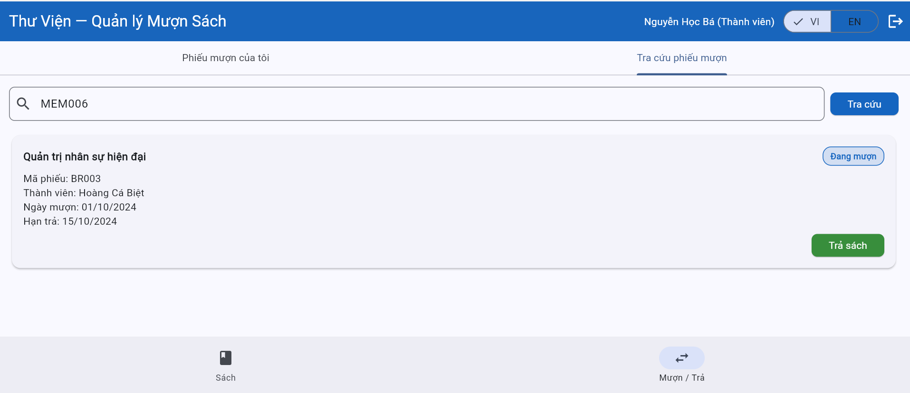

# Bug Reports — Báo cáo lỗi

> **Hướng dẫn**: Tạo 1 mục bug cho mỗi TC có kết quả **Fail**.
> Xem [examples/sample-bug-report.md](../examples/sample-bug-report.md) để hiểu cách viết bug report tốt.
> Mỗi bug cần: tiêu đề mô tả hành vi lỗi, bước tái hiện, expected vs actual, severity + giải thích.

| Thông tin | |
|---|---|
| **Nhóm** | `<!-- Tên nhóm -->` |
| **Ngày báo cáo** | `<!-- DD/MM/YYYY -->` |

---

## BUG-01

| Thuộc tính | Chi tiết |
|-----------|---------|
| **Mã lỗi** | BUG-01 |
| **TC liên quan** | TC-02 |
| **REQ liên quan** | REQ-05 |
| **Mức độ** | High |
| **Người phát hiện** | Tạ Quang Huy |
| **Ngày phát hiện** | 24/05/2026|
| **Trạng thái** | Open |

**Tiêu đề:**
System does not display overdue warning when a member returns an overdue book

**Môi trường:**
- Trình duyệt: Chrome 148.0.7778.179
- Hệ điều hành: Window 11
- Ngôn ngữ giao diện: Tiếng Việt/ English

**Điều kiện tiên quyết:**
Logged in as ba.nguyen@email.com (MEM002)
Fresh seed data (page refreshed or "Khôi phục dữ liệu" clicked)
Borrow record BR001 exists: MEM002 borrowed BOOK003, due date 15/09/2024 (overdue as of 2026)

**Bước tái hiện:**
1. Log in as `ba.nguyen@email.com`
2. Go to tab "Borrow/Return"
3. Find borrow record BR001 (BOOK003 — "Kiểm thử phần mềm nhập môn", due 15/09/2024)
4. Click "Return" on BR001
5. Confirm the return action if prompted
6. Observe the result

**Kết quả mong đợi:**
According to REQ-05:
- Return is accepted
- An overdue warning message is displayed (e.g. "Sách trả quá hạn", banner, or modal alert)
- BR001 status changes to "Returned"
- BOOK003 status changes to "Available"

**Kết quả thực tế:**
- Return was accepted and BR001 status changed to "Returned"
- BOOK003 status changed to "Available"
- No overdue warning was displayed at any point — the return completed silently as if the book was returned on time

**Tác động:**
- Violates REQ-05 business rule: overdue returns must trigger a warning
- Librarian and member have no visibility into whether a return was late
- Late return history is lost — cannot be used for future penalty or policy enforcement
- Members are not informed of overdue behavior, undermining accountability`

**Minh chứng:**
`<!-- Đính kèm ảnh chụp màn hình nếu có -->`

**Đề xuất xử lý:**
After the return action, compare the actual return date with `dueDate` on the borrow record. If `returnDate > dueDate`, display an overdue warning message before or after confirming the return

---

## BUG-02

| Thuộc tính | Chi tiết |
|-----------|---------|
| **Mã lỗi** | BUG-02 |
| **TC liên quan** | TC-07 |
| **REQ liên quan** | REQ-08 |
| **Mức độ** | Critical |
| **Người phát hiện** | Tạ Quang Huy |
| **Ngày phát hiện** | 25/05/2026 |
| **Trạng thái** | Open |

**Tiêu đề:**
Member can search and view borrow records of other members, and can return books on their behalf — unauthorized access and action

**Môi trường:**
- Trình duyệt: Chrome 148.0.7778.179
- Hệ điều hành: Window 11
- Ngôn ngữ giao diện: Tiếng Việt/ English

**Điều kiện tiên quyết:**
- Logged in as `ba.nguyen@email.com` (MEM002 — Nguyễn Học Bá, role: Member)
- Fresh seed data (page refreshed or "Khôi phục dữ liệu" clicked)
- BR003 exists: borrowed by MEM006 (Hoàng Cá Biệt), book "Quản trị nhân sự hiện đại", status "Borrowing"

**Bước tái hiện:**
1. Log in as `ba.nguyen@email.com` (MEM002)
2. Go to tab "Borrow/Return"
3. Click "Search borrow records" tab
4. In the search field, type `MEM006` and click "Search"
5. Observe the search results
6. Click "Returned" on the displayed record BR003

**Kết quả mong đợi:**
According to REQ-08: 
- Search by another member's ID returns **no results** for a Member-role user
- MEM002 cannot see BR003 (owned by MEM006) under any circumstance
- The "Return book" button is never accessible for another member's record
- System enforces read and write isolation between member accounts

**Kết quả thực tế:**
- Searching "MEM006" in the "Search borrow records" field returned BR003 (book: "Quản trị nhân sự hiện đại", member: Hoàng Cá Biệt, borrow date: 01/10/2024, due: 15/10/2024)
- The record was fully visible including member name and borrow details
- The "Return book" button was displayed and functional — MEM002 was able to return a book borrowed by MEM006
**Tác động:**
- **Critical privacy violation**: any member can view the full borrow history of any other member by searching their member ID
- **Critical unauthorized action**: any member can return books on behalf of another member, manipulating borrow records they do not own
- Violates REQ-08 access control requirement directly
- In a real system, this would constitute a serious data breach and could be exploited maliciously

**Minh chứng:**

**Đề xuất xử lý:**
- The "Search borrow records" feature must enforce role-based filtering on the server/data side:
  - If role = "Member": search scope must be restricted to records where `memberId == currentUserId` only — regardless of search input
  - If role = "Librarian": full search access is permitted
- The "Return book" button must also validate that `record.memberId == currentUserId` before allowing the action
- Input in the search field should not be able to override the access control scope

---

<!-- Copy template BUG trên để thêm BUG-03, BUG-04, ... cho mỗi TC Fail -->
