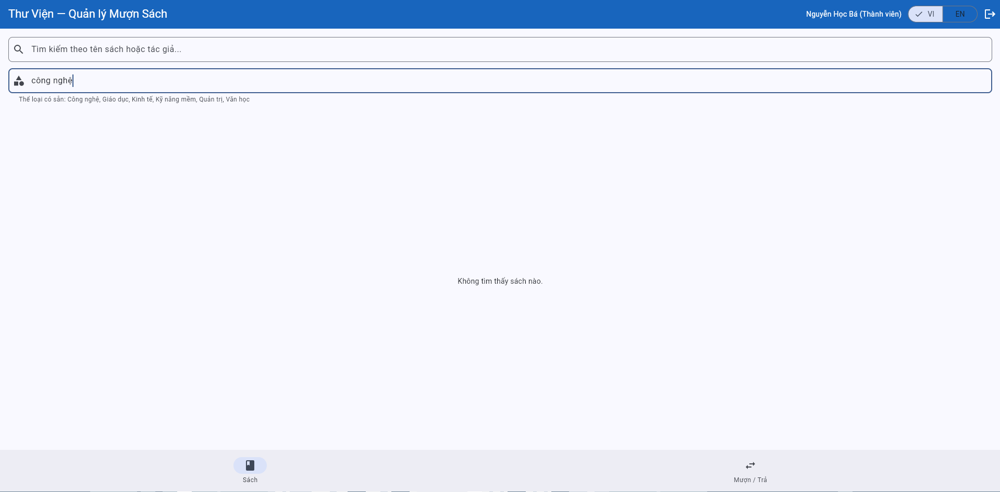
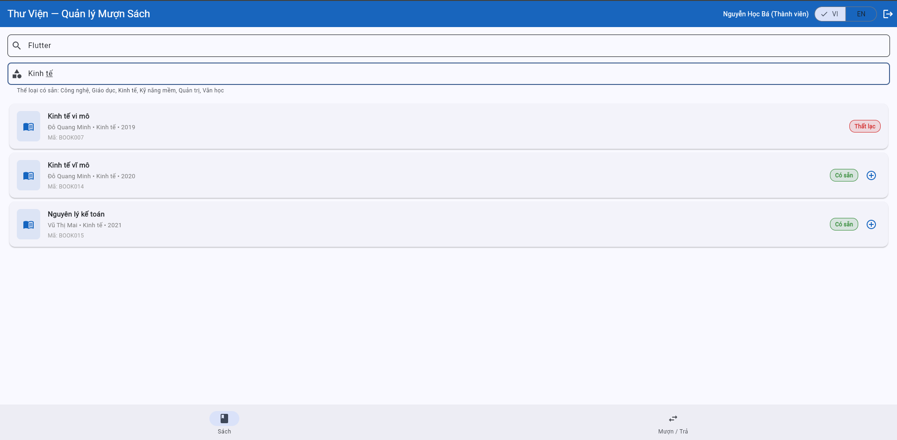
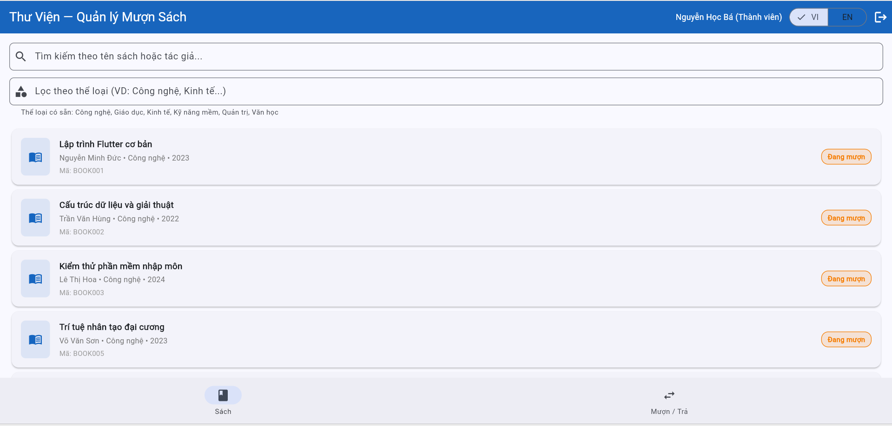
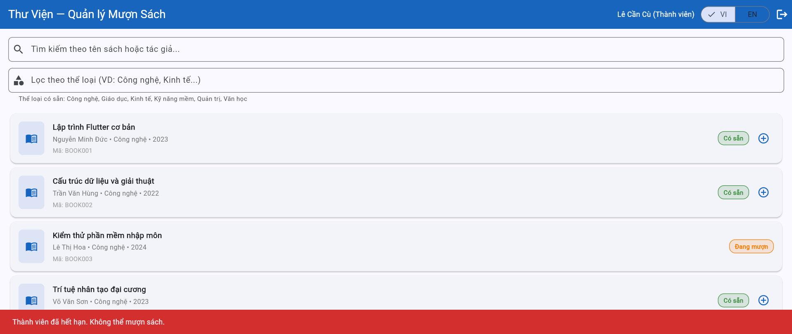

# Bug Reports — Báo cáo lỗi

| Information | |
|---|---|
| **Nhóm** | Group 19 |
| **Ngày báo cáo** | 24/05/2026 |

---

## BUG-01

| Attribute | Details |
|-----------|---------|
| **Bug ID** | BUG-01 |
| **Related TC** | TC-309, TC-310 |
| **Related REQ** | REQ-03 |
| **Severity** | Low |
| **Reporter** | Nguyen Minh Duc |
| **Date Found** | 22/05/2026 |
| **Status** | Open |

**Title:**
Category filter is case-sensitive, causing "Book not found" error

**Environment:**
- Browser: Chrome 136.0.7103.93
- OS: Windows 11
- UI Language: Vietnamese

**Prerequisites:**
Successfully logged in. Currently on "Books" tab. Search box is empty.

**Steps to Reproduce:**
1. Enter the keyword `công nghệ` (all lowercase) or `CÔNG NGHỆ` (all uppercase) into the category filter input box.
2. Observe the resulting list of books displayed.

**Expected Result:**
The filter system should be case-insensitive, just like the search box, returning books under the "Công nghệ" (Technology) category.

**Actual Result:**
The book list is empty, displaying the message "Không tìm thấy sách" (Book not found). The filter box is currently case-sensitive.

**Impact:**
Causes confusion for users when typing lower/uppercase, resulting in an inconsistent experience with the search box (which is case-insensitive).

**Evidence:**
 

**Proposed Solution:**
Add a lowercase normalization function (e.g., `toLowerCase()`) for both the filter keyword and the book category data before comparing.

---

## BUG-02

| Attribute | Details |
|-----------|---------|
| **Bug ID** | BUG-02 |
| **Related TC** | TC-311 |
| **Related REQ** | REQ-03 |
| **Severity** | Medium |
| **Reporter** | Nguyen Minh Duc |
| **Date Found** | 22/05/2026 |
| **Status** | Open |

**Title:**
Combined search and filter behave inconsistently when the search box has no results

**Environment:**
- Browser: Chrome 136.0.7103.93
- OS: Windows 11
- UI Language: Vietnamese

**Prerequisites:**
Successfully logged in. Currently on "Books" tab.

**Steps to Reproduce:**
1. Enter `Kinh tế` into the category filter box (there are books in the Economy category).
2. Enter `Flutter` into the search box.
3. Observe the list of books.

**Expected Result:**
The system consistently applies the "AND" logic. Since there are no books named "Flutter" in the "Kinh tế" category, the system should return an empty list and display "Không tìm thấy sách" (Book not found).

**Actual Result:**
The system seems to ignore the search condition and continues to display all books in the "Kinh tế" category (BOOK007, BOOK014, BOOK015).

**Impact:**
Combined search logic is flawed, returning incorrect results when one of the two conditions does not match, which misleads user expectations.

**Evidence:**

**Proposed Solution:**
Update the book list retrieval logic: Both filters must be applied simultaneously (AND). If either condition is not met, the final result list must be empty.

---

## BUG-03

| Thuộc tính | Chi tiết |
|-----------|---------|
| **Mã lỗi** | BUG-03 |
| **TC liên quan** | TC-24 |
| **REQ liên quan** | REQ-04 |
| **Mức độ** | **High** — Violates core business rules by allowing members to borrow books beyond the maximum limit, leading to system inventory discrepancies|
| **Người phát hiện** | Pham Dinh Anh Duong |
| **Ngày phát hiện** | 23/05/2026 |
| **Trạng thái** | Open |

**Tiêu đề:**
System allows member to borrow 4 books concurrently (Off-by-one boundary error on the limit of 3 books)

**Môi trường:**
- Trình duyệt: Chrome Version 148.0.7778.179
- Hệ điều hành: Windows
- Ngôn ngữ giao diện: Tiếng Việt

**Điều kiện tiên quyết:**
- Member account `"ba.nguyen@email.com"` is logged in.
- The account currently has exactly 1 active borrowed book record in the system (according to Seed Data).

**Bước tái hiện:**
1. Navigate to the "Books" tab.
2. Click the `(+)` button to borrow book `BOOK002` (Total active borrows = 2).
3. Click the `(+)` button to borrow book `BOOK004` (Total active borrows = 3).
4. Attempt to borrow a 4th book (`BOOK005`) by clicking its `(+)` button.

**Kết quả mong đợi:**
At step 4, the system must block the action and display a clear error message stating: "Đã đạt giới hạn 3 cuốn sách" (Maximum limit of 3 books reached) to prevent the 4th book from being borrowed.

**Kết quả thực tế:**
At step 4, the system allows the borrow action for `BOOK005` to process successfully. The member's total active borrowed books increases to 4 without any warning or restriction.

**Tác động:**
Allows users to bypass the business rule constraint. If deployed to production, it will break the library inventory workflow, disrupt book availability tracking, and negatively impact other members' borrowing privileges.

**Minh chứng:**

**Đề xuất xử lý:**
Verify the comparison operator inside the active borrows validation logic. Ensure the system restricts the borrow action if `active_borrows >= 3` instead of an incorrect condition like `< 4` or `<= 3`.

---

## BUG-04

| Thuộc tính | Chi tiết |
|-----------|---------|
| **Mã lỗi** | BUG-04 |
| **TC liên quan** | TC-25 |
| **REQ liên quan** | REQ-04 |
| **Mức độ** | **High** — System misidentifies user core account state and displays an incorrect, misleading error message during the core workflow |
| **Người phát hiện** | Pham Dinh Anh Duong |
| **Ngày phát hiện** | 23/05/2026 |
| **Trạng thái** | Open |

**Tiêu đề:**
"Suspended" member account displays incorrect error message stating "Thành viên đã hết hạn" upon borrowing

**Môi trường:**
- Trình duyệt: Chrome 148.0.7778.179
- Hệ điều hành: Windows
- Ngôn ngữ giao diện: Tiếng Việt

**Điều kiện tiên quyết:**
- Member account `"cu.le@email.com"` is logged in (Account status is Suspended in Seed Data).

**Bước tái hiện:**
1. Navigate to the "Books" tab.
2. Find any book that is currently marked as "Có sẵn" (Available).
3. Click the `(+)` button to attempt to borrow the book.

**Kết quả mong đợi:**
The system blocks the action and displays a specific error message reflecting that the account is currently "Suspended / Temporarily Disabled".

**Kết quả thực tế:**
The system blocks the action but displays an incorrect, unrelated red error banner at the bottom stating: "Thành viên đã hết hạn. Không thể mượn sách." (Member has expired. Cannot borrow book).

**Tác động:**
The system mismaps and misidentifies the user state workflow. It misleads suspended members about the actual reason their features are locked, making it difficult for administrators or librarians to handle user complaints and inquiries accurately.

**Minh chứng:**

**Đề xuất xử lý:**
Check the error handling logic or the conditional flow (`switch/case` or `if/else`) that validates member status during the borrow process. Ensure that the error code returned for a `Suspended` account maps to its correct UI string instead of falling back to the `Expired` account message string.
---

## BUG-05

| Thuộc tính          | Chi tiết      |
| ------------------- | ------------- |
| **Mã lỗi**          | BUG-t5        |
| **TC liên quan**    | `TC-36`       |
| **REQ liên quan**   | `REQ-06 `     |
| **Mức độ**          | `Medium `     |
| **Người phát hiện** | `Ha Dang Huy` |
| **Ngày phát hiện**  | `23/5/2026`   |
| **Trạng thái**      | ` Open`       |

**Tiêu đề:**
`Due date = today will not be marked as overdue`

**Môi trường:**

- Trình duyệt: Chrome ` 136.0.7103.93`
- Hệ điều hành: `Windows 11`
- Ngôn ngữ giao diện: Tiếng Việt / English

**Điều kiện tiên quyết:**
`The BR006 record exists, with status "Borrowing"`

**Bước tái hiện:**

1. `1. Log in using your Librarian account. `
2. `2. Click the "Check Expired" button.`

**Kết quả mong đợi:**
`The BR006 record will be marked as	Overdue`

**Kết quả thực tế:**
`The BR006 record will be marked as Overdue or Returned depending on the time.`

**Tác động:**
`Displays the incorrect status for the borrowing record, violating core business rules (failing to properly update the status to "Overdue" on the due date itself). This can prevent librarians from handling overdue books in a timely manner and may result in incorrect fine calculations if applicable`

**Minh chứng:**

**Đề xuất xử lý:**
`<!-- Gợi ý cách sửa lỗi nếu có -->`

---

## BUG-06

| Thuộc tính          | Chi tiết      |
| ------------------- | ------------- |
| **Mã lỗi**          | BUG-06        |
| **TC liên quan**    | `TC-40`       |
| **REQ liên quan**   | `REQ-07`      |
| **Mức độ**          | `High `       |
| **Người phát hiện** | `Ha Dang Huy` |
| **Ngày phát hiện**  | `23/5/2026`   |
| **Trạng thái**      | `Open`        |

**Tiêu đề:**
`Email validation is too loose — it accepts 'test@email`

**Bước tái hiện:**

1. `Log in using Librarian account.  `
2. `Click the "Add member" button.`
3. `Enter the information with email: 'test@email` .`
4. `Click the "Add member" button.`

**Kết quả mong đợi:**
`An error message should appear indicating "Invalid email", and the registration should be blocked`

**Kết quả thực tế:**
`The system accepts the input and displays a "Successfully" notification`

**Tác động:**
`Saves malformed emails into the database, breaking data integrity. This prevents the system from sending crucial notifications (e.g., registration or overdue reminders) and may cause downstream email delivery errors`

**Minh chứng:**

**Đề xuất xử lý:**
`<!-- -->`

---

<!-- Copy template BUG trên để thêm BUG-03, BUG-04, ... cho mỗi TC Fail -->

## BUG-07

| Thuộc tính          | Chi tiết      |
| ------------------- | ------------- |
| **Mã lỗi**          | BUG-07        |
| **TC liên quan**    | `TC-42`       |
| **REQ liên quan**   | `REQ-07`      |
| **Mức độ**          | `Medium `     |
| **Người phát hiện** | `Ha Dang Huy` |
| **Ngày phát hiện**  | `23/5/2026`   |
| **Trạng thái**      | `Open`        |

**Tiêu đề:**
`Valid email syntax is not accepted`

**Bước tái hiện:**

1. `Log in using Librarian account.  `
2. `Click the "Add member" button.`
3. `Enter the information with email: 'test@email.com` .`
4. `Click the "Add member" button.`

**Kết quả mong đợi:**
`The system accepts the input, successfully registers the member, and displays a success notification. `

**Kết quả thực tế:**
`The system rejects the input and incorrectly displays an "Invalid email" error message.`

**Tác động:**
`Prevents valid users from registering or updating their profiles with legitimate email addresses. This completely blocks the account creation workflow for valid members and disrupts library operations.`

**Minh chứng:**

**Đề xuất xử lý:**
`<!-- -->`

---

## BUG-08

| Thuộc tính | Chi tiết |
|-----------|---------|
| **Mã lỗi** | BUG-08 |
| **TC liên quan** | TC-31 |
| **REQ liên quan** | REQ-05 |
| **Mức độ** | High |
| **Người phát hiện** | Tạ Quang Huy |
| **Ngày phát hiện** | 24/05/2026|
| **Trạng thái** | Open |

**Tiêu đề:**
System does not display overdue warning when a member returns an overdue book

**Môi trường:**
- Trình duyệt: Chrome 148.0.7778.179
- Hệ điều hành: Window 11
- Ngôn ngữ giao diện: Tiếng Việt/ English

**Điều kiện tiên quyết:**
Logged in as ba.nguyen@email.com (MEM002)
Fresh seed data (page refreshed or "Khôi phục dữ liệu" clicked)
Borrow record BR001 exists: MEM002 borrowed BOOK003, due date 15/09/2024 (overdue as of 2026)

**Bước tái hiện:**
1. Log in as `ba.nguyen@email.com`
2. Go to tab "Borrow/Return"
3. Find borrow record BR001 (BOOK003 — "Kiểm thử phần mềm nhập môn", due 15/09/2024)
4. Click "Return" on BR001
5. Confirm the return action if prompted
6. Observe the result

**Kết quả mong đợi:**
According to REQ-05:
- Return is accepted
- An overdue warning message is displayed (e.g. "Sách trả quá hạn", banner, or modal alert)
- BR001 status changes to "Returned"
- BOOK003 status changes to "Available"

**Kết quả thực tế:**
- Return was accepted and BR001 status changed to "Returned"
- BOOK003 status changed to "Available"
- No overdue warning was displayed at any point — the return completed silently as if the book was returned on time

**Tác động:**
- Violates REQ-05 business rule: overdue returns must trigger a warning
- Librarian and member have no visibility into whether a return was late
- Late return history is lost — cannot be used for future penalty or policy enforcement
- Members are not informed of overdue behavior, undermining accountability`

**Minh chứng:**
`<!-- Đính kèm ảnh chụp màn hình nếu có -->`

**Đề xuất xử lý:**
After the return action, compare the actual return date with `dueDate` on the borrow record. If `returnDate > dueDate`, display an overdue warning message before or after confirming the return

---

## BUG-09

| Thuộc tính | Chi tiết |
|-----------|---------|
| **Mã lỗi** | BUG-09 |
| **TC liên quan** | TC-47 |
| **REQ liên quan** | REQ-08 |
| **Mức độ** | Critical |
| **Người phát hiện** | Tạ Quang Huy |
| **Ngày phát hiện** | 25/05/2026 |
| **Trạng thái** | Open |

**Tiêu đề:**
Member can search and view borrow records of other members, and can return books on their behalf — unauthorized access and action

**Môi trường:**
- Trình duyệt: Chrome 148.0.7778.179
- Hệ điều hành: Window 11
- Ngôn ngữ giao diện: Tiếng Việt/ English

**Điều kiện tiên quyết:**
- Logged in as `ba.nguyen@email.com` (MEM002 — Nguyễn Học Bá, role: Member)
- Fresh seed data (page refreshed or "Khôi phục dữ liệu" clicked)
- BR003 exists: borrowed by MEM006 (Hoàng Cá Biệt), book "Quản trị nhân sự hiện đại", status "Borrowing"

**Bước tái hiện:**
1. Log in as `ba.nguyen@email.com` (MEM002)
2. Go to tab "Borrow/Return"
3. Click "Search borrow records" tab
4. In the search field, type `MEM006` and click "Search"
5. Observe the search results
6. Click "Returned" on the displayed record BR003

**Kết quả mong đợi:**
According to REQ-08: 
- Search by another member's ID returns **no results** for a Member-role user
- MEM002 cannot see BR003 (owned by MEM006) under any circumstance
- The "Return book" button is never accessible for another member's record
- System enforces read and write isolation between member accounts

**Kết quả thực tế:**
- Searching "MEM006" in the "Search borrow records" field returned BR003 (book: "Quản trị nhân sự hiện đại", member: Hoàng Cá Biệt, borrow date: 01/10/2024, due: 15/10/2024)
- The record was fully visible including member name and borrow details
- The "Return book" button was displayed and functional — MEM002 was able to return a book borrowed by MEM006
**Tác động:**
- **Critical privacy violation**: any member can view the full borrow history of any other member by searching their member ID
- **Critical unauthorized action**: any member can return books on behalf of another member, manipulating borrow records they do not own
- Violates REQ-08 access control requirement directly
- In a real system, this would constitute a serious data breach and could be exploited maliciously

**Minh chứng:**

**Đề xuất xử lý:**
- The "Search borrow records" feature must enforce role-based filtering on the server/data side:
  - If role = "Member": search scope must be restricted to records where `memberId == currentUserId` only — regardless of search input
  - If role = "Librarian": full search access is permitted
- The "Return book" button must also validate that `record.memberId == currentUserId` before allowing the action
- Input in the search field should not be able to override the access control scope

---