# Test Execution — Kết quả thực thi kiểm thử

| Thông tin | |
|---|---|
| **Nhóm** | Group 19 |
| **Ngày thực thi** | 24/05/2026 |
| **Trình duyệt** | Chrome 148.0.7778.179 (Official Build) (64-bit) |
| **Hệ điều hành** | Windows |

---

## Detailed Results

### REQ-01 — Login

| TC ID | Functional Group | Expected Result (Summary)                               | Actual Result                                                                                             | Conclusion | Evidence | Bug    |
| ----- | -------------- | --------------------------------------------------------- | ----------------------------------------------------------------------------------------------------------- | -------- | ---------- | ------ |
| TC-01 | Login      | Go to home page, AppBar displays "Thủ thư"              | System redirects to home page. AppBar shows name and role "Thủ thư". "Thành viên" tab appears.      | **Pass** | 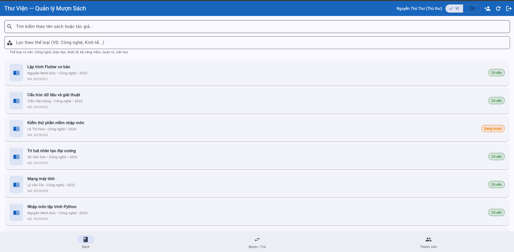  | —      |
| TC-02 | Login      | Go to home page, AppBar displays "Thành viên"           | System redirects to home page. AppBar shows "Ba Nguyễn — Thành viên". "Thành viên" tab does not appear. | **Pass** | 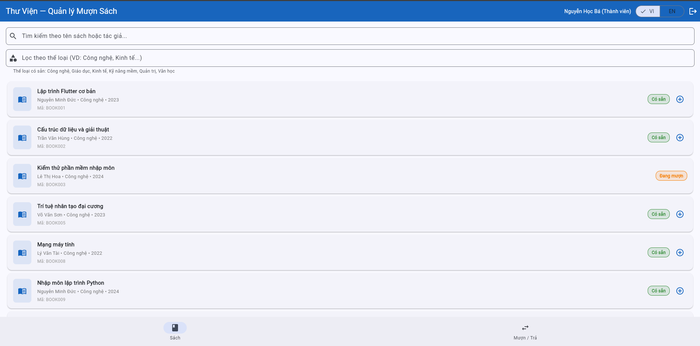   | —      |
| TC-03 | Login      | "Không tìm thấy thành viên"                              | System does not redirect. Displays message "Không tìm thấy thành viên".                               | **Pass** | 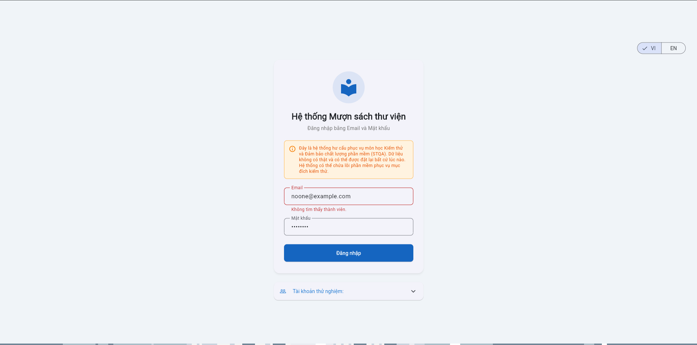     | —      |
| TC-04 | Login      | "Mật khẩu không đúng"                                    | System does not redirect. Displays message "Mật khẩu không đúng".                                     | **Pass** | 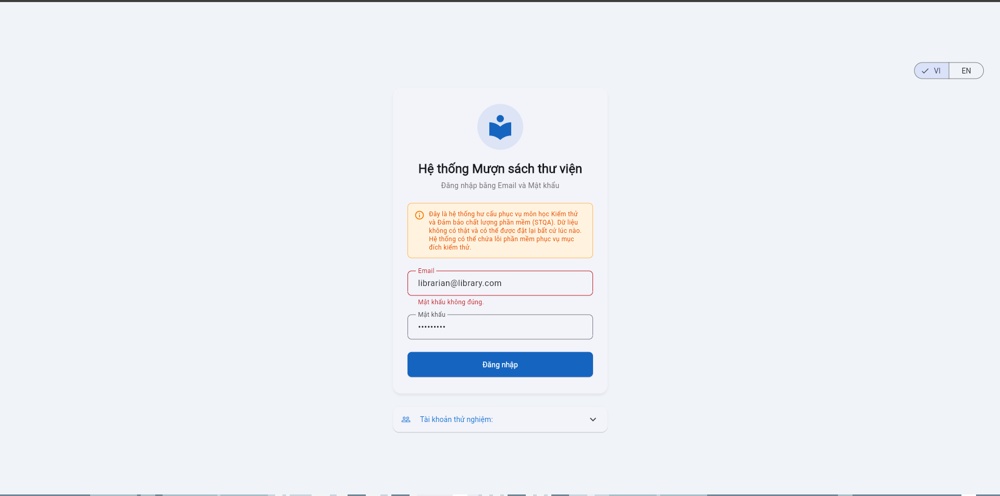    | —      |
| TC-05 | Login      | "Vui lòng nhập email và mật khẩu"                        | System does not redirect. Displays message "Vui lòng nhập email và mật khẩu".                         | **Pass** | 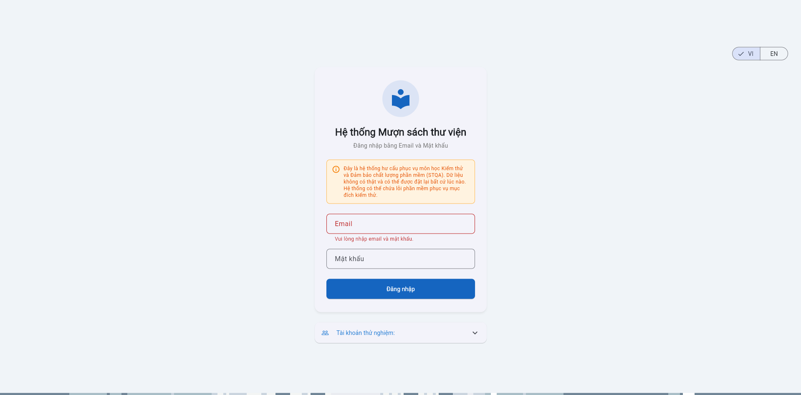   | —      |
| TC-06 | Login      | "Vui lòng nhập email và mật khẩu"                        | System does not redirect. Displays message "Vui lòng nhập email và mật khẩu".                         | **Pass** | 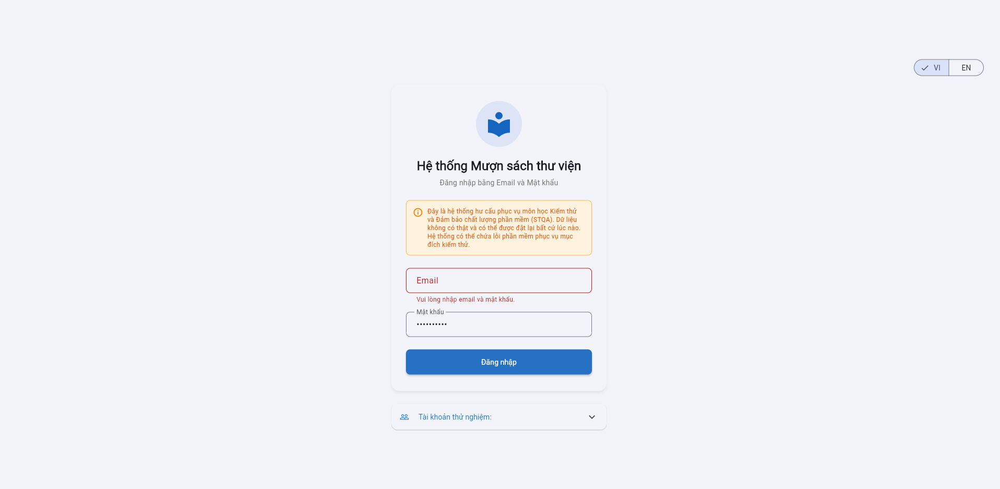  | —      |
| TC-07 | Login      | "Vui lòng nhập email và mật khẩu"                        | System does not redirect. Displays message "Vui lòng nhập email và mật khẩu".                         | **Pass** | 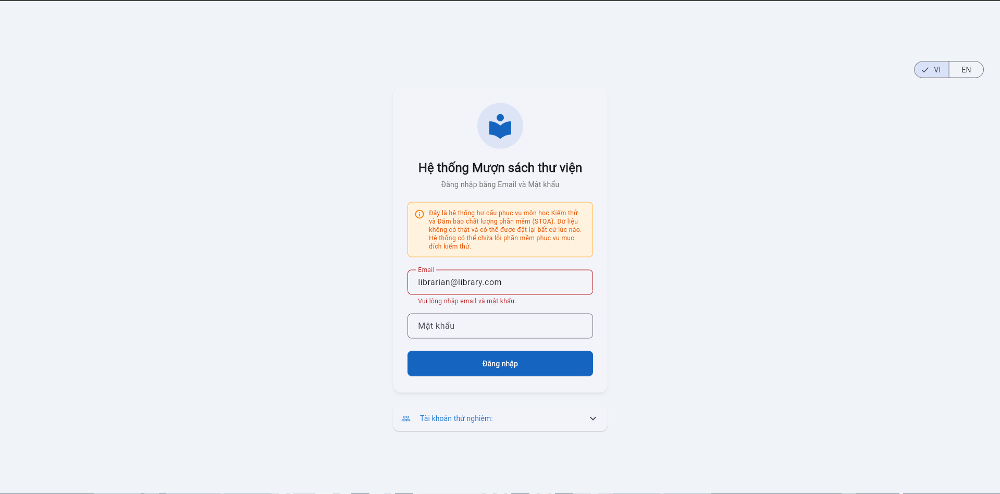  | —      |

---

### REQ-02 — View Book List

| TC ID | Feature Group | Expected Result (Summary) | Actual Result | Conclude | Proof(evidence) | Bug |
|-------|---------------|---------------------------|-----------------|---------|-----------|----| 
| TC-08 | REQ-02 (View Book) |Displays all 20 books with 5 detailed information fields | System displays all 20 books with 5 fields (Title, Author, Genre, Publication Year, Status) | Pass |   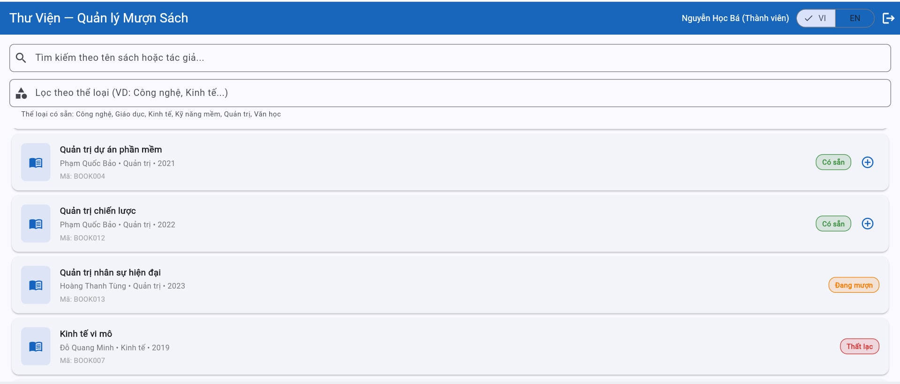  | None |
| TC-09 | REQ-02 (View Book) |Book status changes to "Borrowed" and (+) button is hidden instantly without page refresh (F5)|Status updates to "Borrowed", and the (+) button disappears instantly without needing a page refresh|Pass| 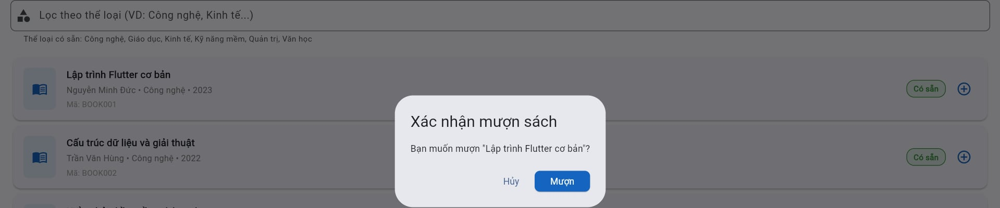  |None |
| TC-10 | REQ-02 (View Book) |Librarian can view all 20 books with the 5 detailed fields |Librarian can view all 20 books with the exact same 5 details as a Member |Pass|      |None|

### REQ-03 — Search and Filter Books (TCs based on SRS)

| TC ID | Functional Group     | Expected Result (Summary)                                       | Actual Result                                                                                               | Conclusion | Evidence | Bug |
| ----- | ------------------ | ----------------------------------------------------------------- | ------------------------------------------------------------------------------------------------------------- | -------- | ---------- | --- |
| TC-11 | Search & Filter    | Only display BOOK001 when searching "Flutter"                           | List only displays BOOK001 "Lập trình Flutter cơ bản". Other books are hidden.                             | **Pass** | 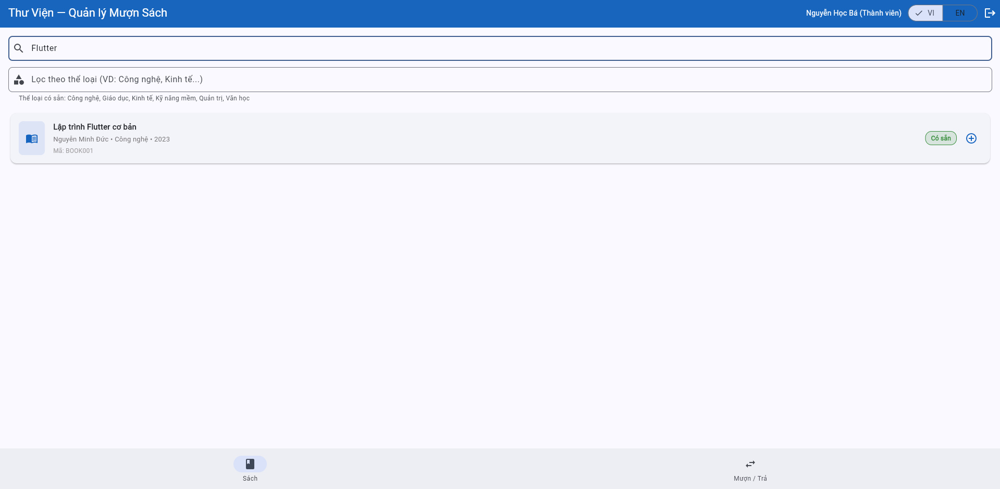  | —   |
| TC-12 | Search & Filter    | Display BOOK001, BOOK009 when searching "Nguyễn Minh Đức"             | List displays BOOK001 and BOOK009. Books by other authors are hidden.                                         | **Pass** | 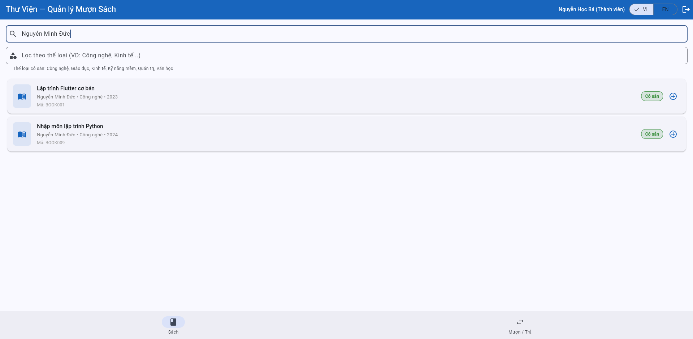   | —   |
| TC-13 | Search & Filter    | "Không tìm thấy sách" when searching "XYZ123abc"                       | List does not display any book. Displays message "Không tìm thấy sách".                                | **Pass** | 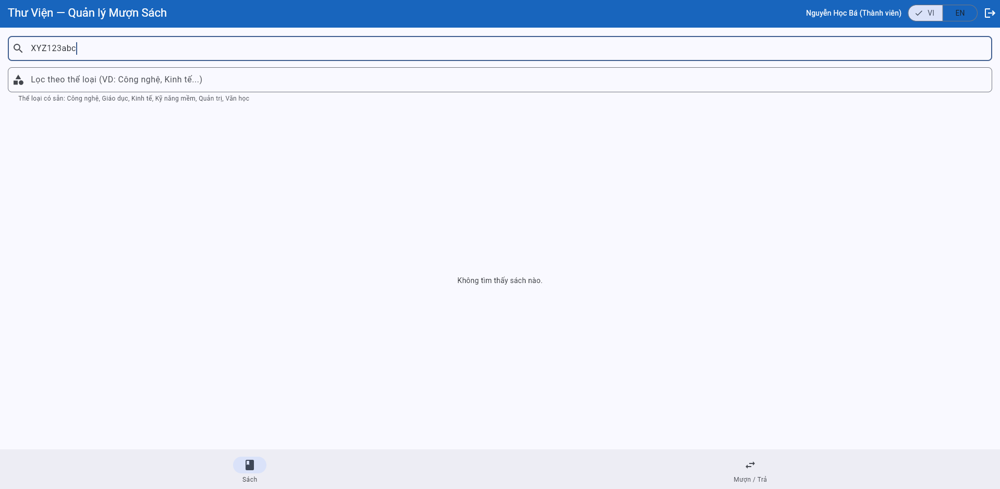   | —   |
| TC-14 | Search & Filter    | Result same as TC-10 when searching "flutter" (lowercase)              | List displays BOOK001. Search is case-insensitive.                                            | **Pass** | 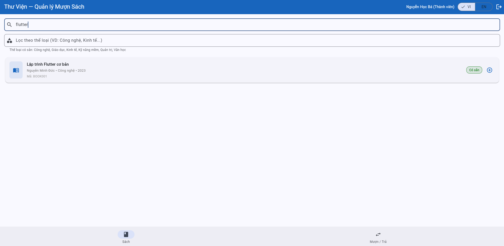 | —   |
| TC-15 | Search & Filter    | Result same as TC-10 when searching "FLUTTER" (uppercase)                 | List displays BOOK001. Search is case-insensitive.                                            | **Pass** | 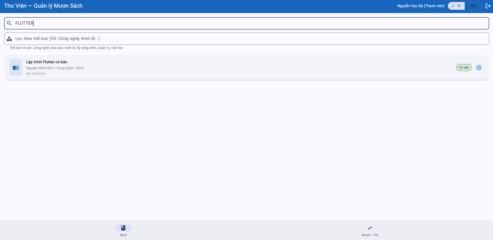   | —   |
| TC-16 | Search & Filter    | Result same as TC-10 when searching "fLuTtEr" (mixed case)            | List displays BOOK001. Search is case-insensitive.                                            | **Pass** | 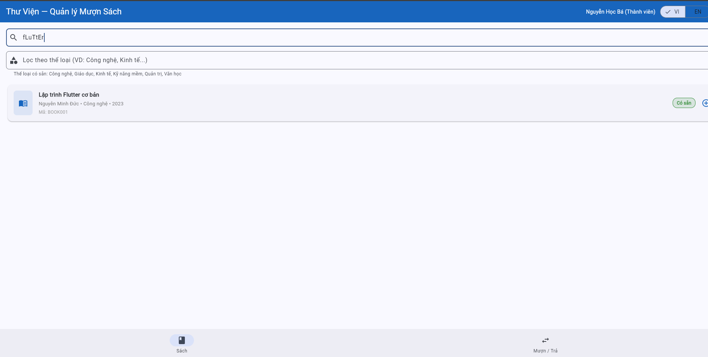  | —   |
| TC-17 | Search & Filter    | Re-display 20 books when clearing search box to empty              | List displays all 20 book titles again. No longer filtered by any keyword.                                 | **Pass** | 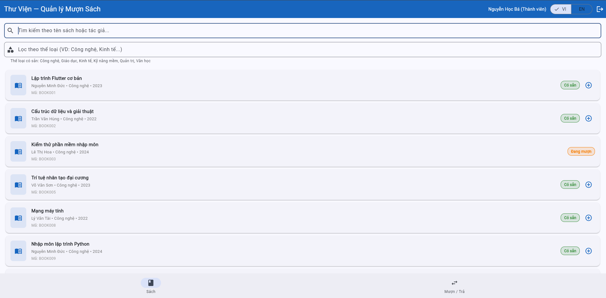  | —   |
| TC-18 | Search & Filter    | Only display Công nghệ books when entering "Công nghệ" into filter box      | List only displays BOOK001, 002, 003, 005, 008, 009, 010, 011. Books from other categories are hidden.                | **Pass** | 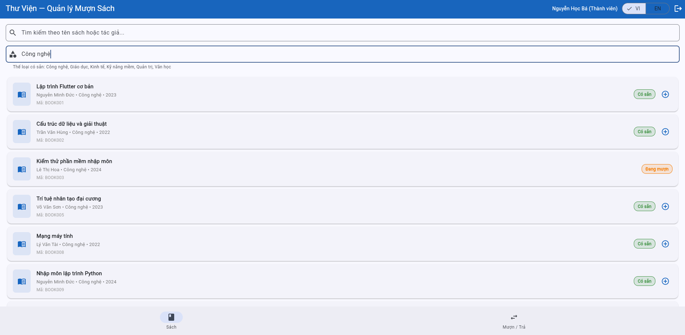  | —   |
| TC-19 | Search & Filter    | Filter "công nghệ" (lowercase)                                   | List displays no books. Filter is case-sensitive.                                            | **Fail** |   | BUG |
| TC-20 | Search & Filter    | Filter "CÔNG NGHỆ" (uppercase)                                      | List displays no books. Filter is case-sensitive.                                            | **Fail** | 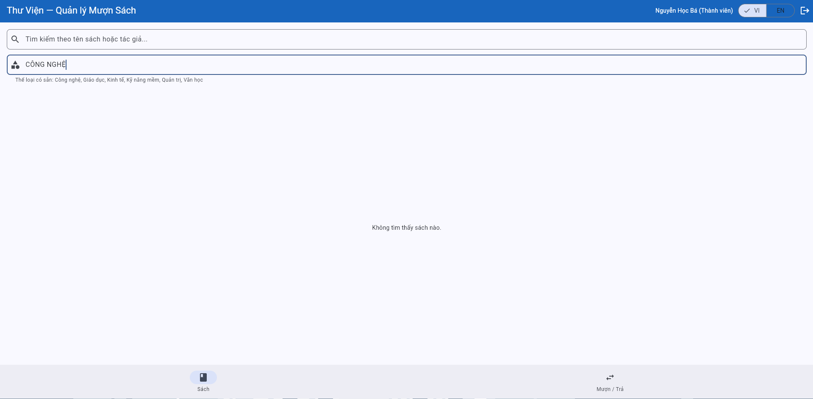  | BUG |
| TC-21 | SRS Gap — combine  | Observation: filter "Kinh tế" + search "Flutter" — result when AND has no books? | List displays **BOOK007, BOOK014, BOOK015** (all Kinh tế books). The "Flutter" search is **ignored** as there's no matching result in category — behavior is **inconsistent** with TC-25 (AND logic). | **Fail** *(SRS gap)*        |   | BUG |

### REQ-04: / Borrow Book

| TC ID | Feature Group | Expected Result (Summary) | Actual Result | Conclude | Proof(evidence) | Bug |
|-------|---------------|---------------------------|-----------------|---------|-----------|----| 
| TC-22 | REQ-04 (Borrow) |Shows success message. Borrow record shows due date = borrow date + 14 days |Success message displayed. Borrow/Return tab shows the due date is exactly 14 days from the borrow date|Pass| 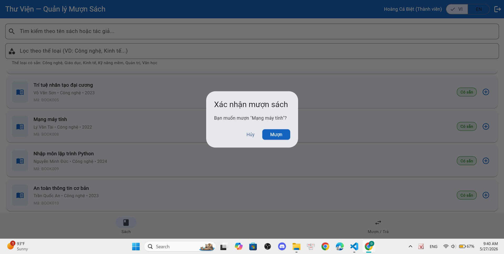 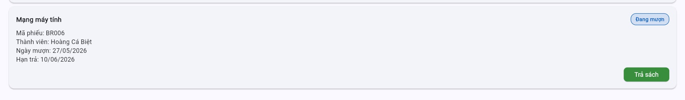 |None|
| TC-23 | REQ-04 (Borrow) |System rejects the 4th book attempt with a "limit reached" error message|System allows borrowing up to the 4th book successfully. It only rejects and shows an error on the 5th attempt|Fail||BUG|                 
| TC-24 | REQ-04 (Borrow) |System rejects the action and shows a specific error for "Suspended" accounts|System blocks the action but displays the incorrect error message: "Member has expired"|Fail||BUG|
| TC-25 | REQ-04 (Borrow) |Books with "Borrowed" status have the (+) borrow button hidden/disabled|BOOK003 does not have the (+) button; the borrow action cannot be performed|Pass|  |None|
| TC-26 | REQ-04 (Borrow) |System rejects the action and shows an error message for "Expired" accounts|System blocks the action and displays the correct error message for expired accounts|Pass| 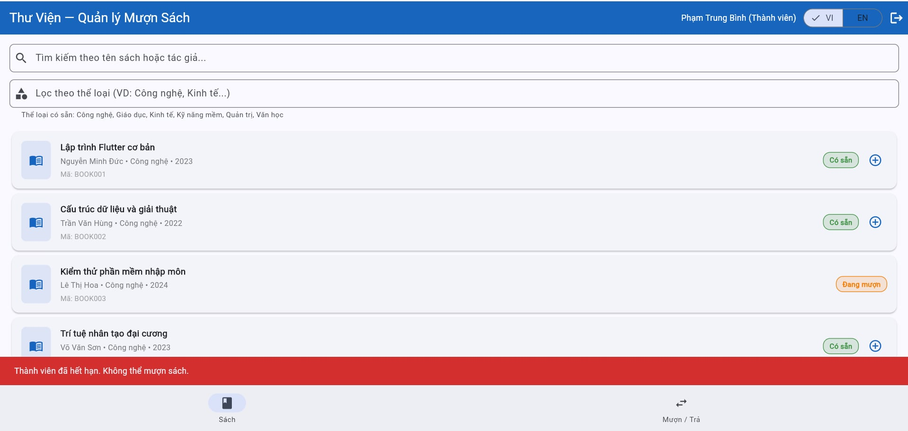 |None |
| TC-27 | REQ-04 (Borrow) |Books with "Lost" status have the (+) borrow button hidden/disabled|BOOK007 does not have the (+) button; the borrow action cannot be performed|Pass| 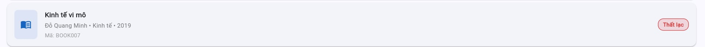 |None|
| TC-28 | REQ-04 (Borrow) |System allows successful borrow (bringing the total active borrows to exactly 2)|System allows the borrow action successfully, bringing the total number of borrowed books to 2|Pass|   |None |

### REQ-05: Return Book

| TC ID | Feature Group | Expected Result (Summary) | Actual Result | Conclude | Proof(evidence) | Bug |
|-------|---------------|---------------------------|-----------------|---------|-----------|----| 
| TC-29 | Return Book (REQ-05) | Return succeeds. Record status = "Returned". BOOK001 = "Available". No overdue warning. |Return succeeded. Record status updated to "Returned". BOOK001 changed to "Available". No overdue warning shown.| Pass | 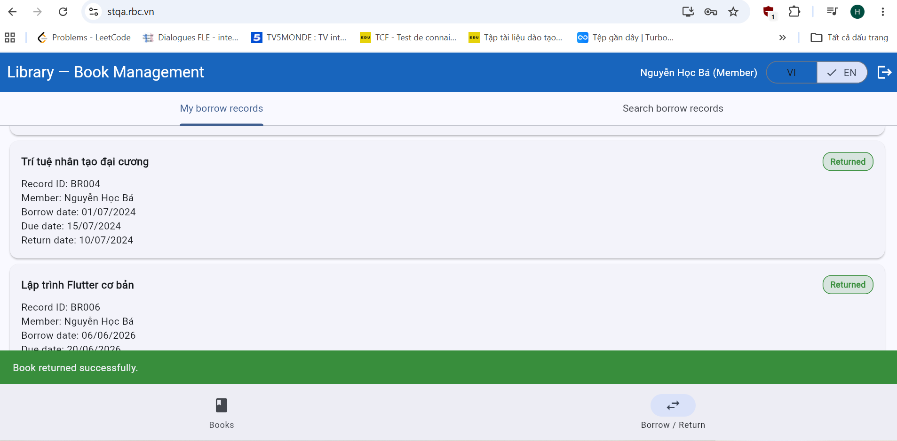 | 
| TC-30 | Return Book (REQ-05) | Return accepted. Overdue warning displayed. BR001 = "Returned". BOOK003 = "Available". |Return was accepted and BR001 status changed to "Returned". BOOK003 changed to "Available". However, no overdue warning was displayed.| Fail|  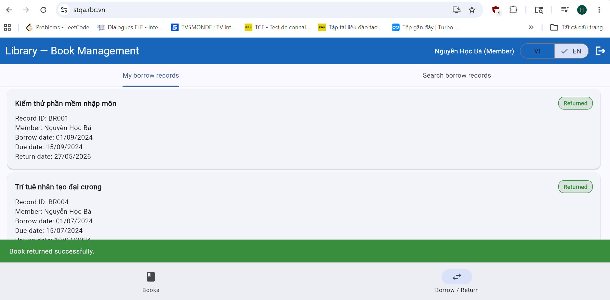 |BUG |
| TC-31 | Return Book (REQ-05) | BOOK013 not in MEM002's list. No Return button for BOOK013. System does not allow returning another member's book. | BOOK013 did not appear in MEM002's borrow list. No Return button was available for BOOK013. | Pass |  |  |
| TC-32 | Return Book (REQ-05) | Before return: BOOK003 = "Borrowed". After return: BOOK003 = "Available" immediately, no page refresh needed. | Before return: BOOK003 = "Borrowed". After return: BOOK003 = "Available" immediately without page refresh. |Pass |   |

### REQ-06 — Overdue Handling

| TC ID | Feature Group | Expected Result (Summary) | Actual Result | Conclude | Proof(evidence) | Bug |
|-------|---------------|---------------------------|-----------------|---------|-----------|----| 
| TC-33  | REQ-06         | BR007 changes to Overdue status.                                                                      | The system changes BR007 to Overdue                                                     | Pass     |  |     |
| TC-34  | REQ-06         | BR008 DOES NOT change status (remains Borrowing).                                                     | BR008 maintains its Borrowing status.                                                   | Pass     |  |
| TC-35  | REQ-06         | BR006 changes to Overdue status.                                                                      | BR006 maintains its Borrowing status.                                                   | Fail     | 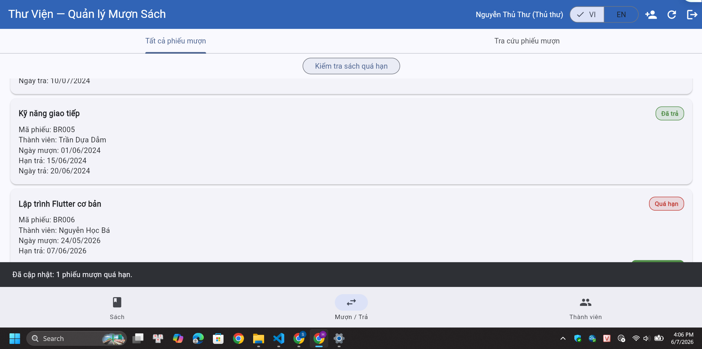 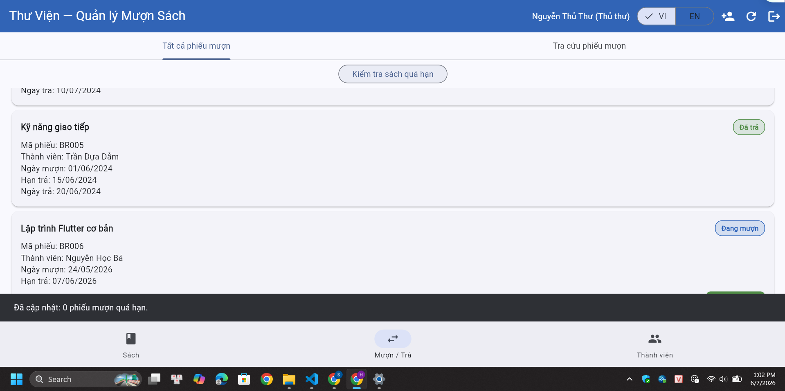 |
| TC-36  | REQ-06         | BR002 (Returned) DOES NOT change status.                                                              | BR002 isnt changed status.                                                              | Pass     |  |
| TC-37  | REQ-06         | User dam.tran sees BR005 is Overdue.                                                                  | User dam.tran sees BR005 is Overdue.                                                    | Pass     | 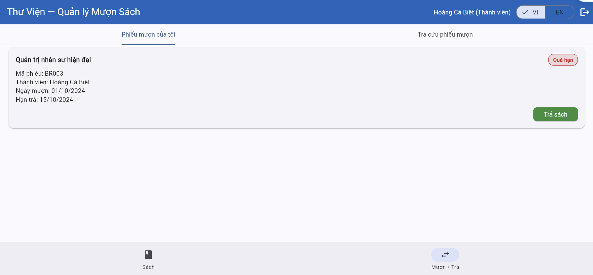 |
| TC-38  | REQ-06         | Librarian sees both BR005 and BR001 as Overdue.                                                       | Librarian sees both BR005 and BR001 as Overdue.                                         | Pass     | 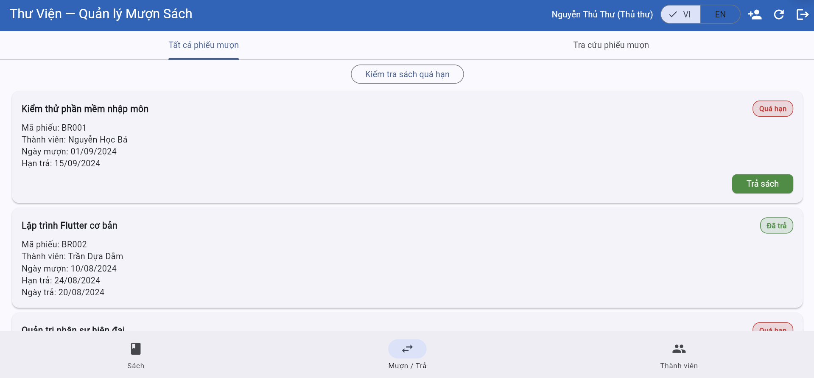 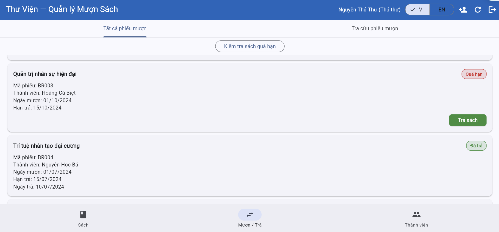 | 

### REQ-07 — Member Management

| TC ID | Feature Group | Expected Result (Summary) | Actual Result | Conclude | Proof(evidence) | Bug |
|-------|---------------|---------------------------|-----------------|---------|-----------|----| 
| TC-39  | REQ-07         | Member added successfully.                                                                            | The system rejects the input and incorrectly displays an "Invalid email" error message. | Fail     | 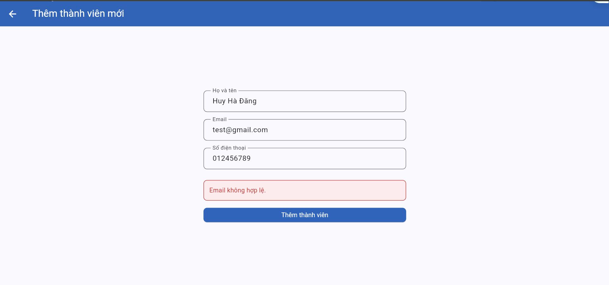 | BUG |
| TC-40  | REQ-07         | The system display an "Invalid email" error message                                                   | The system display an "Invalid email" error message                                     | Pass     | 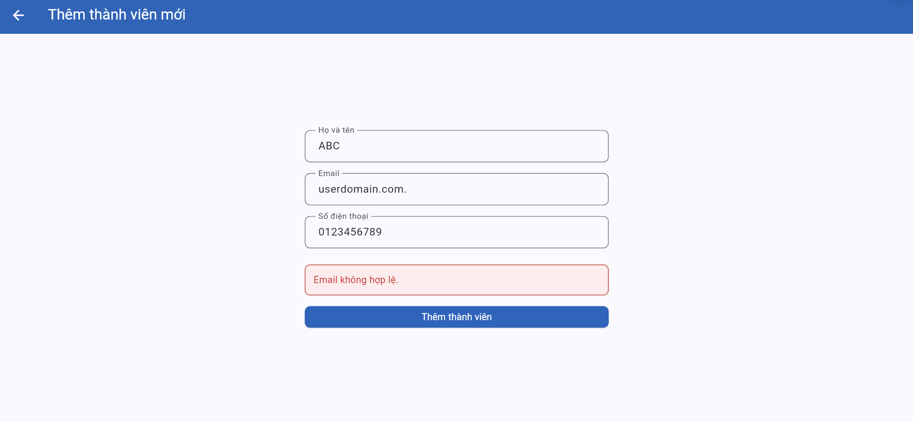|
| TC-41 | REQ-07         | The system accepts the input, successfully registers the member, and displays a success notification. | The system display an "Invalid email" error message                                     | Fail     | 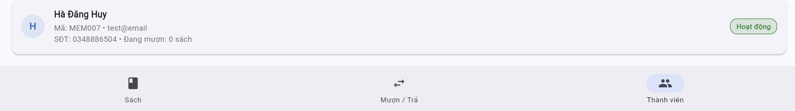 | BUG|
| TC-42 | REQ-07         | The system display an "Invalid email" error message                                                   | The system display an "Invalid email" error message                                     | Pass     | 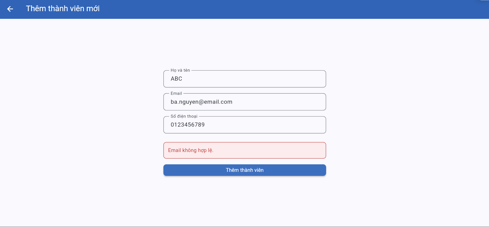 |

### REQ-08 — Borrow Record Lookup

| TC ID | Feature Group | Expected Result (Summary) | Actual Result | Conclude | Proof(evidence) | Bug |
|-------|---------------|---------------------------|-----------------|---------|-----------|----| 
| TC-43 | Borrow Record Lookup (REQ-08) | All 5 seed records (BR001–BR005) visible. Records from MEM002, MEM003, MEM006 all shown. Each record shows: ID, book name, borrow date, due date, status. |All 5 records (BR001–BR005) were visible. Records from multiple members (MEM002, MEM003, MEM006) all displayed. All required fields shown correctly.|Pass| 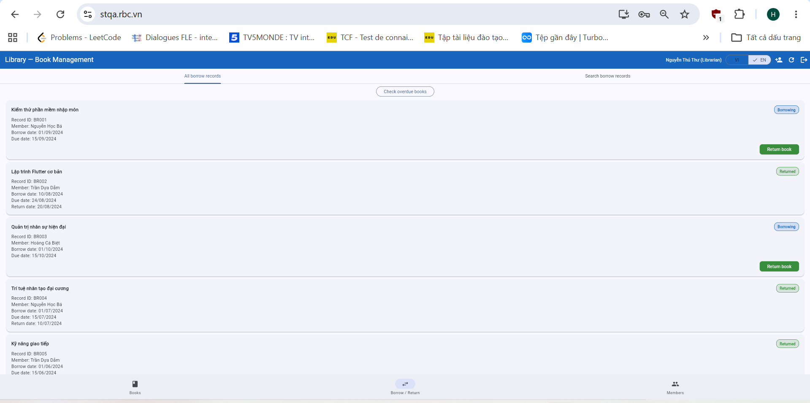 | |
| TC-44 | Borrow Record Lookup (REQ-08) | Only BR001 (BOOK003) and BR004 (BOOK005) visible. Records BR002, BR003, BR005 NOT shown. Each record shows: ID, book, dates, status. | Only BR001 and BR004 were shown in MEM002's default view. Records belonging to other members were not shown by default. | Pass| 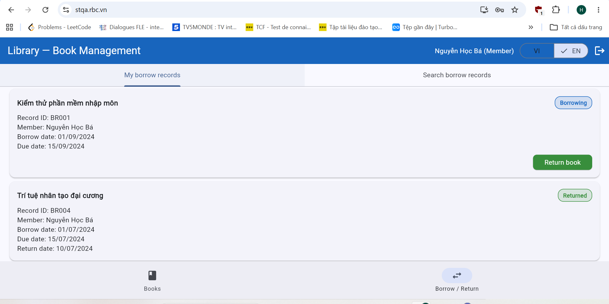 | |
| TC-45 | Borrow Record Lookup (REQ-08) | Search "MEM006" returns no results. BR003 not visible anywhere in MEM002's view. | Search "MEM006" returned BR003 (Quản trị nhân sự hiện đại). Full record details visible to MEM002 including member name, borrow date, due date and status. | Fail |  | BUG |
|TC - 46 |Borrow Record Lookup / Return Book |"Return" button not shown or disabled for BR003. Return action rejected. BR003 stays "Borrowing". BOOK013 stays "Borrowed". |After searching MEM006 and locating BR003, the "Return" button was displayed and functional. MEM002 successfully returned BOOK013 on behalf of MEM006. BR003 changed to "Returned" and BOOK013 changed to "Available". | Fail|  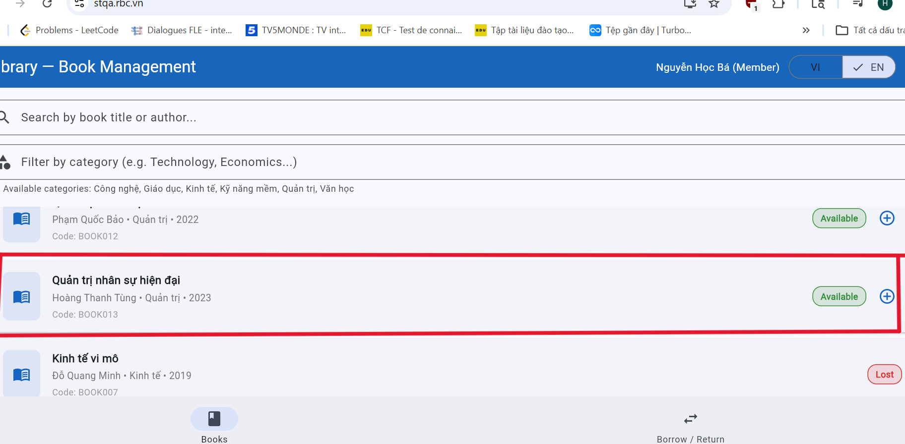 | BUG |
| TC-47 | Borrow Record Lookup (REQ-08) | BR002 visible in MEM003's list. Status = "Returned". Fields: ID=BR002, book="Lập trình Flutter cơ bản", borrow=10/08/2024, due=24/08/2024. | BR002 was visible. Status showed "Returned". All fields displayed correctly: ID=BR002, book="Lập trình Flutter cơ bản", borrow date=10/08/2024, due date=24/08/2024 | Pass |  | |
| TC-48 | Borrow Record Lookup (REQ-08) | After librarian runs overdue check: BR001 status = "Overdue". Visible to both MEM002 and Librarian with correct status. | After librarian clicked "Check overdue books", BR001 status updated to "Overdue". Both MEM002 and Librarian could see the updated status correctly. | Pass|   | |
| TC-49 | Borrow Record Lookup (REQ-08) | After overdue check: BR001 = "Overdue". After return: BR001 = "Returned". BOOK003 = "Available". Record not stuck at "Overdue". | BR001 transitioned correctly from "Overdue" to "Returned" after return action. BOOK003 changed to "Available". No record stuck at "Overdue". | Pass|  |  |
| | | | | | | |

## Summary of Results
 
| Metric | Value |
|--------|-------|
| Total test cases | 49 |
| Pass | 39 |
| Fail | 10 |
| Blocked | 0 |
| Not Run | 0 |
| **Pass Rate** | **79.6% (39/49)** |
 
### Results by Feature Group
 
| Feature Group | Total TCs | Pass | Fail | Pass Rate |
|---|---|---|---|---|
| Login (REQ-01) | 7 | 7 | 0 | 100% |
| View Book List (REQ-02) | 3 | 3 | 0 | 100% |
| Search & Filter Books (REQ-03) | 12 | 9 | 3 | 75% |
| Borrow Book (REQ-04) | 7 | 5 | 2 | 71% |
| Return Book (REQ-05) | 4 | 3 | 1 | 75% |
| Overdue Handling (REQ-06) | 6 | 5 | 1 | 83% |
| Member Management (REQ-07) | 4 | 2 | 2 | 50% |
| Borrow Record Lookup (REQ-08) | 6 | 5 | 1 | 83% |
| **Total** | **49** | **39** | **10** | **79.6%** |
