# Test Execution — Kết quả thực thi kiểm thử

> **Hướng dẫn**: Chạy từng TC trên hệ thống https://stqa.rbc.vn, ghi lại kết quả thực tế.
> Kết luận: **Pass** (kết quả đúng), **Fail** (kết quả sai → tạo bug report), **Blocked** (không thực hiện được vì lỗi khác chặn), **Not Run** (chưa chạy).

| Thông tin | |
|---|---|
| **Nhóm** | `<!-- Tên nhóm -->` |
| **Ngày thực thi** | `<!-- DD/MM/YYYY -->` |
| **Trình duyệt** | Chrome `<!-- version -->` |
| **Hệ điều hành** | `<!-- Windows / macOS / Linux -->` |

---

## Kết quả chi tiết

| Mã TC | Nhóm chức năng | Kết quả mong đợi (tóm tắt) | Kết quả thực tế | Kết luận | Minh chứng | Bug |
|-------|---------------|---------------------------|-----------------|---------|-----------|----|
|TC-500 |Return Book (REQ-05)|Return succeeds. No overdue warning. Record = "Returned". Book = "Available" | No overdue warning. Record = "Returned". Book = "Available". Borrowed BOOK001 today (dueDate = today + 14). Returned on exact due date. Return succeeded. Record status = "Returned". BOOK001 = "Available". No overdue warning was displayed. |Pass |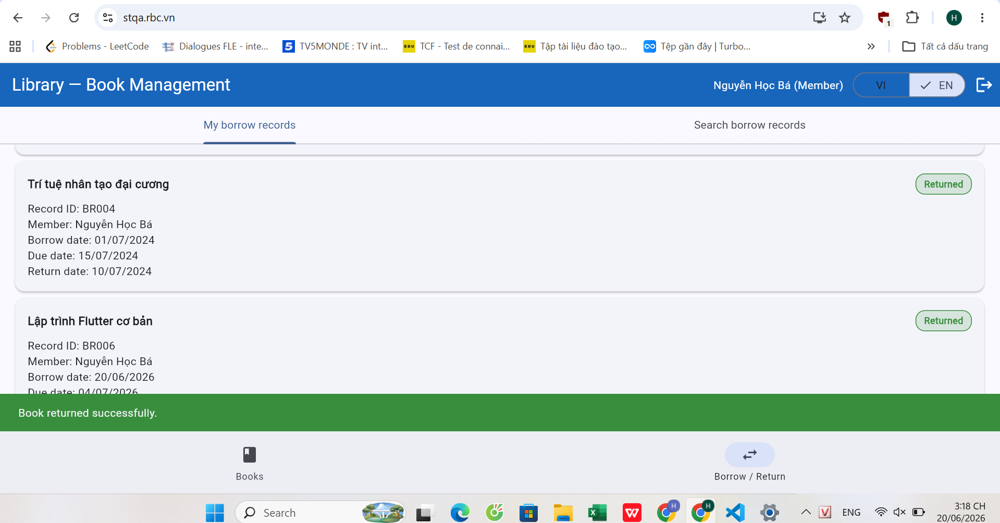| |
| TC-501 | Return Book (REQ-05) | Return succeeds. Record status = "Returned". BOOK001 = "Available". No overdue warning. |Return succeeded. Record status updated to "Returned". BOOK001 changed to "Available". No overdue warning shown.| Pass | | | 
| TC-502 | Return Book (REQ-05) | Return accepted. Overdue warning displayed. BR001 = "Returned". BOOK003 = "Available". |Return was accepted and BR001 status changed to "Returned". BOOK003 changed to "Available". However, no overdue warning was displayed.| Fail|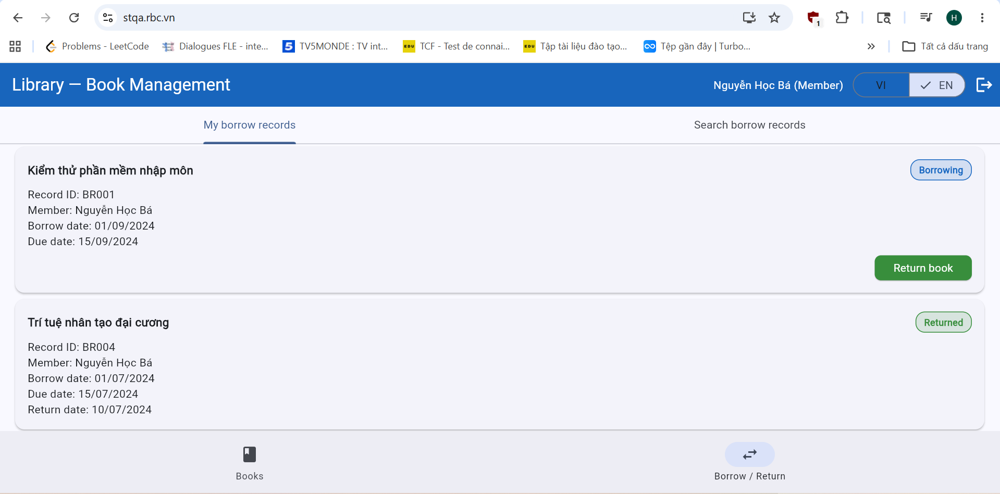 .png)|BUG -01 |
| TC-503 | Return Book (REQ-05) | BOOK013 not in MEM002's list. No Return button for BOOK013. System does not allow returning another member's book. | BOOK013 did not appear in MEM002's borrow list. No Return button was available for BOOK013. | Pass | 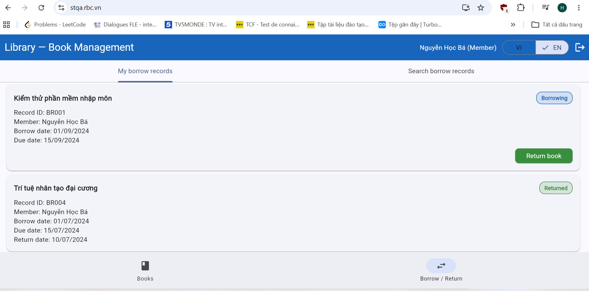 |  |
| TC-504 | Return Book (REQ-05) | Before return: BOOK003 = "Borrowed". After return: BOOK003 = "Available" immediately, no page refresh needed. | Before return: BOOK003 = "Borrowed". After return: BOOK003 = "Available" immediately without page refresh. |Pass |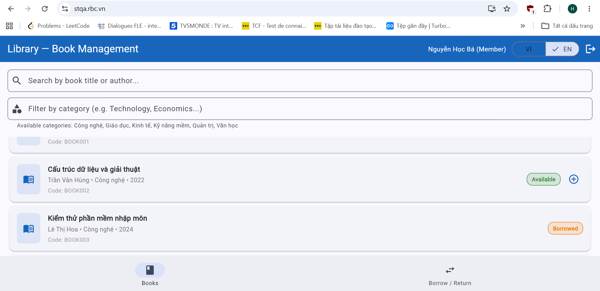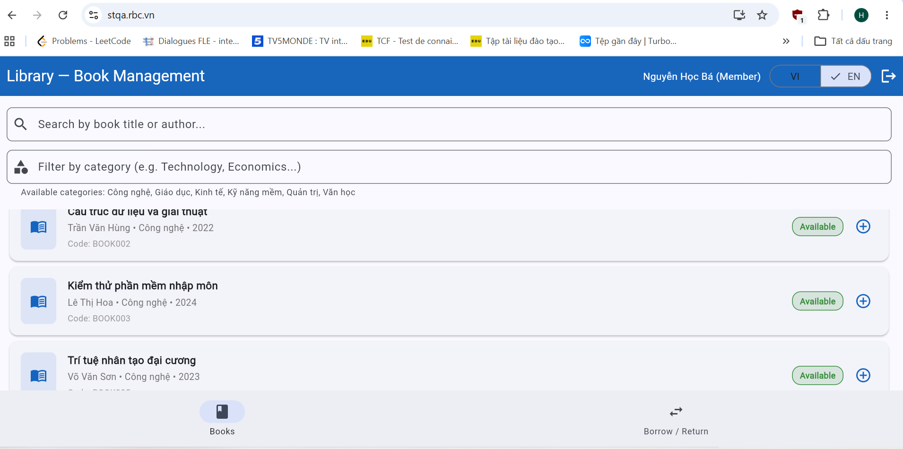 ||
| TC-801 | Borrow Record Lookup (REQ-08) | All 5 seed records (BR001–BR005) visible. Records from MEM002, MEM003, MEM006 all shown. Each record shows: ID, book name, borrow date, due date, status. |All 5 records (BR001–BR005) were visible. Records from multiple members (MEM002, MEM003, MEM006) all displayed. All required fields shown correctly.|Pass| | |
| TC-802 | Borrow Record Lookup (REQ-08) | Only BR001 (BOOK003) and BR004 (BOOK005) visible. Records BR002, BR003, BR005 NOT shown. Each record shows: ID, book, dates, status. | Only BR001 and BR004 were shown in MEM002's default view. Records belonging to other members were not shown by default. | Pass|  | |
| TC-803 | Borrow Record Lookup (REQ-08) | Search "MEM006" returns no results. BR003 not visible anywhere in MEM002's view. | Search "MEM006" returned BR003 (Quản trị nhân sự hiện đại). Full record details visible to MEM002 including member name, borrow date, due date and status. | Fail | 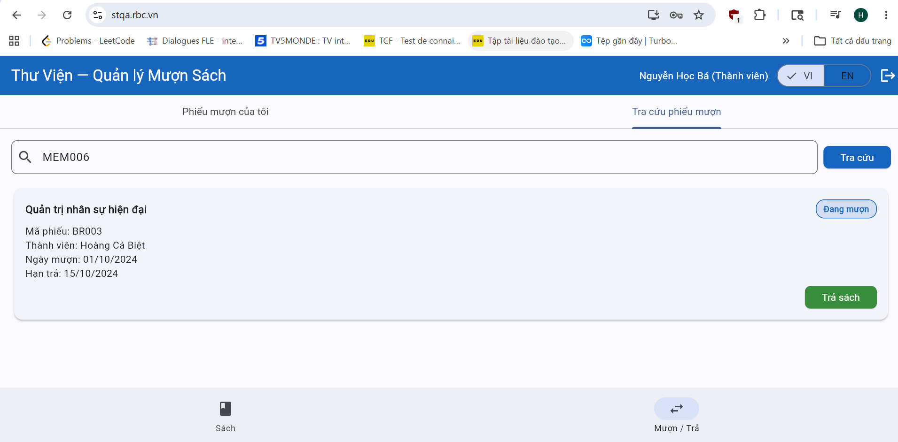| BUG- 02 |
|TC - 804 |Borrow Record Lookup / Return Book |"Return" button not shown or disabled for BR003. Return action rejected. BR003 stays "Borrowing". BOOK013 stays "Borrowed". |After searching MEM006 and locating BR003, the "Return" button was displayed and functional. MEM002 successfully returned BOOK013 on behalf of MEM006. BR003 changed to "Returned" and BOOK013 changed to "Available". | Fail| 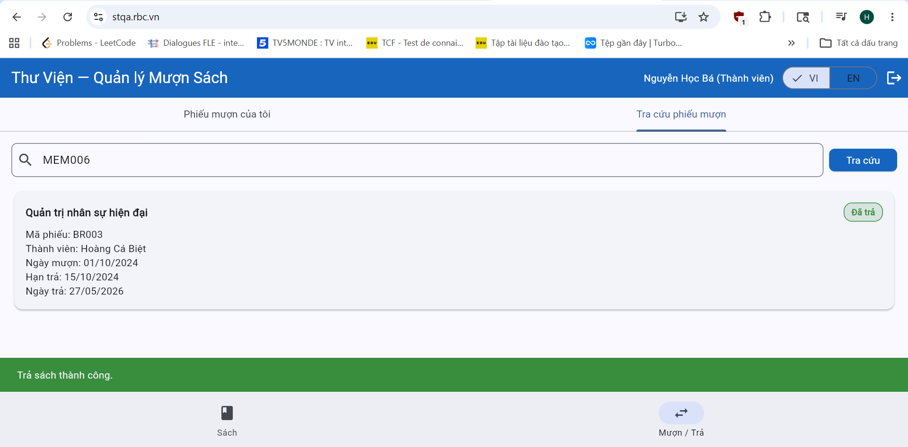.png)| BUG-03 |
| TC-805 | Borrow Record Lookup (REQ-08) | BR002 visible in MEM003's list. Status = "Returned". Fields: ID=BR002, book="Lập trình Flutter cơ bản", borrow=10/08/2024, due=24/08/2024. | BR002 was visible. Status showed "Returned". All fields displayed correctly: ID=BR002, book="Lập trình Flutter cơ bản", borrow date=10/08/2024, due date=24/08/2024 | Pass | 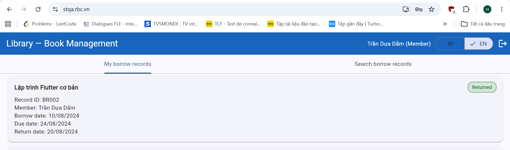| |
| TC-806 | Borrow Record Lookup (REQ-08) | After librarian runs overdue check: BR001 status = "Overdue". Visible to both MEM002 and Librarian with correct status. | After librarian clicked "Check overdue books", BR001 status updated to "Overdue". Both MEM002 and Librarian could see the updated status correctly. | Pass|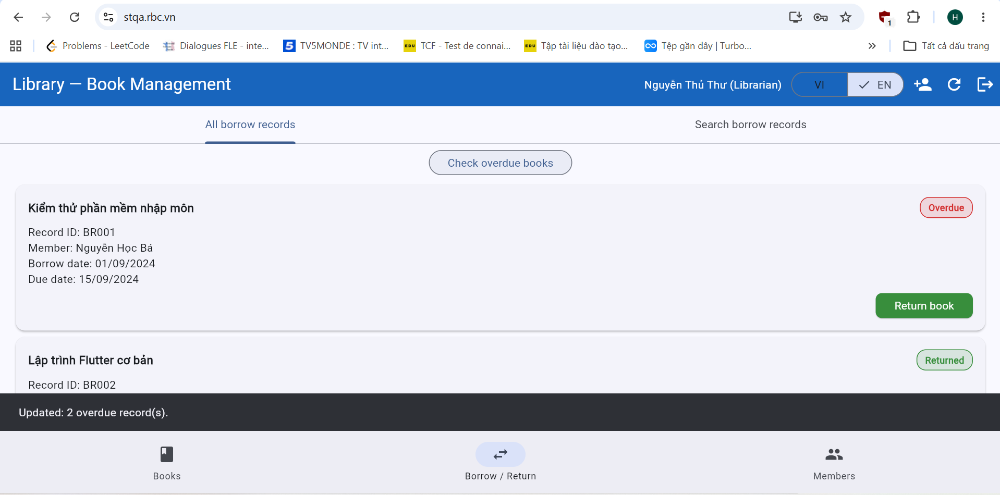 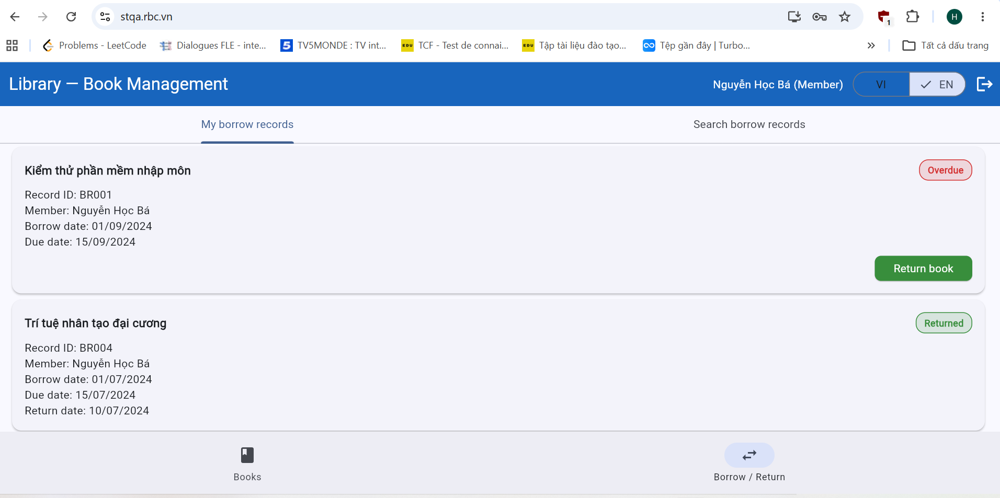 | |
| TC-807 | Borrow Record Lookup (REQ-08) | After overdue check: BR001 = "Overdue". After return: BR001 = "Returned". BOOK003 = "Available". Record not stuck at "Overdue". | BR001 transitioned correctly from "Overdue" to "Returned" after return action. BOOK003 changed to "Available". No record stuck at "Overdue". | Pass|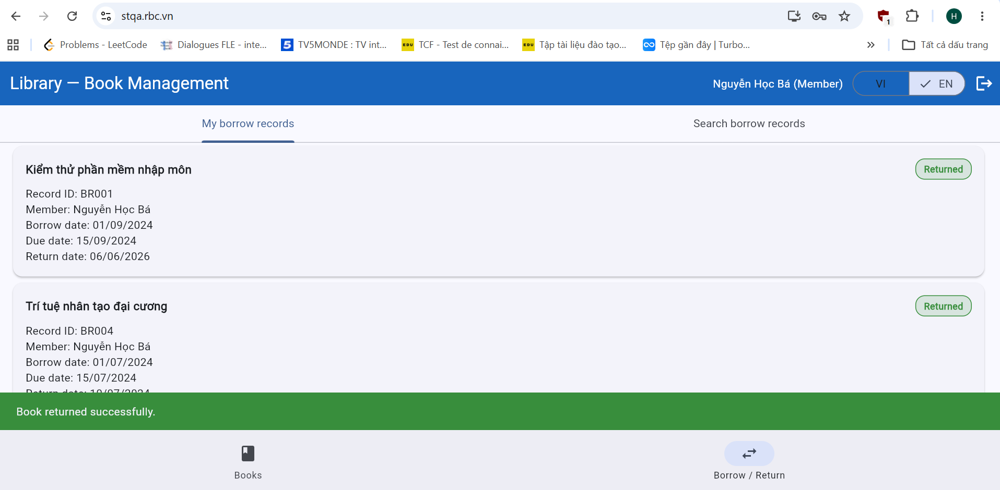 |  |
| | | | | | | |

---

## Tổng hợp kết quả

| Chỉ số | Giá trị |
|--------|---------|
| Tổng số test case | 10 |
| Pass | 8 |
| Fail |2|
| Blocked | 0 |
| Not Run | 0 |
| **Tỷ lệ Pass** | 80% |

### Kết quả theo nhóm chức năng

| Nhóm | Tổng TC | Pass | Fail | Tỷ lệ Pass |
|------|---------|------|------|------------|
|Return Book (REQ-05) |4 | 3|1 | 75%|
| Borrow Record Lookup (REQ-08)|6 |5 |1 |83% |
|Sum|10|8|2|80%
