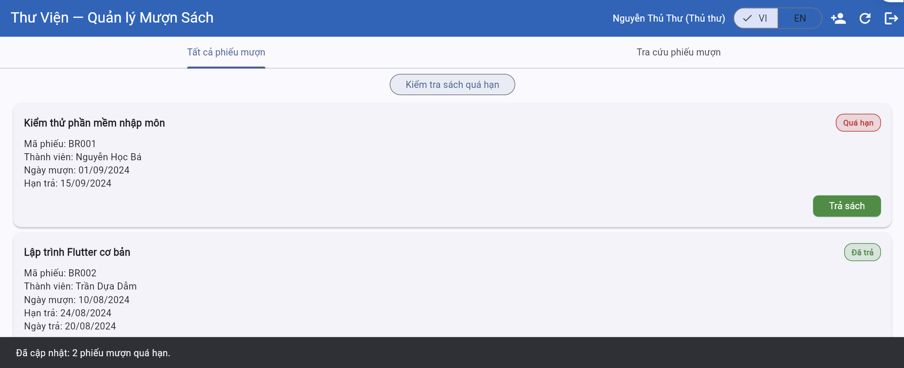
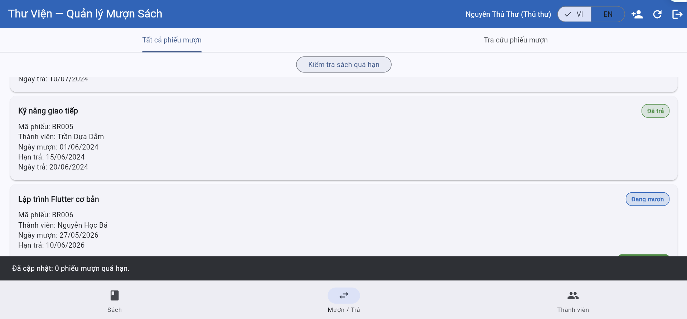
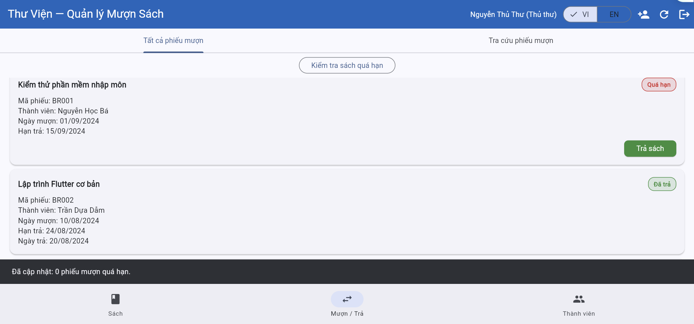

# Test Execution — Kết quả thực thi kiểm thử

> **Hướng dẫn**: Chạy từng TC trên hệ thống https://stqa.rbc.vn, ghi lại kết quả thực tế.
> Kết luận: **Pass** (kết quả đúng), **Fail** (kết quả sai → tạo bug report), **Blocked** (không thực hiện được vì lỗi khác chặn), **Not Run** (chưa chạy).

| Thông tin         |                       |
| ----------------- | --------------------- |
| **Nhóm**          | `<!-- Tên nhóm -->`   |
| **Ngày thực thi** | `<!-- DD/MM/YYYY -->` |
| **Trình duyệt**   | Chrome `124.0.0.0`    |
| **Hệ điều hành**  | `Windows 11`          |

---

## Kết quả chi tiết

| Mã TC  | Nhóm chức năng | Kết quả mong đợi (tóm tắt)                                                                            | Kết quả thực tế                                                                         | Kết luận | Minh chứng                                                          | Bug |
| ------ | -------------- | ----------------------------------------------------------------------------------------------------- | --------------------------------------------------------------------------------------- | -------- | ------------------------------------------------------------------- | --- |
| TC-01  | REQ-06         | BR007 changes to Overdue status.                                                                      | The system changes BR007 to Overdue                                                     | Pass     |                                       |     |
| TC-02  | REQ-06         | BR008 DOES NOT change status (remains Borrowing).                                                     | BR008 maintains its Borrowing status.                                                   | Pass     |                                       |
| TC-03  | REQ-06         | BR006 changes to Overdue status.                                                                      | BR006 maintains its Borrowing status.                                                   | Fail     | ,       | BUG |
| TC-04  | REQ-06         | BR002 (Returned) DOES NOT change status.                                                              | BR002 isnt changed status.                                                              | Pass     |                                       |
| TC-05  | REQ-06         | User biet.hoang sees BR003 is Overdue.                                                                | User biet.hoang sees BR003 is Overdue.                                                  | Pass     |                                       |
| TC-06  | REQ-06         | Librarian sees both BR003 and BR001 as Overdue.                                                       | Librarian sees both BR003 and BR001 as Overdue.                                         | Pass     |  ,  |     |
| TC-08  | REQ-07         | Member added successfully.                                                                            | The system rejects the input and incorrectly displays an "Invalid email" error message. | Fail     |                                        | BUG |
| TC-09  | REQ-07         | The system display an "Invalid email" error message                                                   | The system display an "Invalid email" error message                                     | Pass     |                                        |
| TC-010 | REQ-07         | The system accepts the input, successfully registers the member, and displays a success notification. | The system display an "Invalid email" error message                                     | Fail     |                                         | BUG |
| TC-011 | REQ-07         | The system display an "Invalid email" error message                                                   | The system display an "Invalid email" error message                                     | Pass     |                                         |

---

## Tổng hợp kết quả

| Chỉ số            | Giá trị       |
| ----------------- | ------------- |
| Tổng số test case | `10`          |
| Pass              | `7`           |
| Fail              | `3`           |
| Blocked           | `<!-- số -->` |
| Not Run           | `<!-- số -->` |
| **Tỷ lệ Pass**    | `70%`         |

### Kết quả theo nhóm chức năng

| Nhóm                         | Tổng TC | Pass | Fail | Tỷ lệ Pass |
| ---------------------------- | ------- | ---- | ---- | ---------- |
| RateREQ-06: Overdue Handling | 6       | 5    | 1    | 5/6        |
| REQ-07: Member Management    | 4       | 2    | 2    | 1/2        |
