# Test Execution — Kết quả thực thi kiểm thử

> **Hướng dẫn**: Chạy từng TC trên hệ thống https://stqa.rbc.vn, ghi lại kết quả thực tế.
> Kết luận: **Pass** (kết quả đúng), **Fail** (kết quả sai → tạo bug report), **Blocked** (không thực hiện được vì lỗi khác chặn), **Not Run** (chưa chạy).

| Thông tin | |
|---|---|
| **Nhóm** | `<!-- Tên nhóm -->` |
| **Ngày thực thi** | `<!-- DD/MM/YYYY -->` |
| **Trình duyệt** | Chrome `<!-- version -->` |
| **Hệ điều hành** | `<!-- Windows / macOS / Linux -->` |

---

## Kết quả chi tiết

| Mã TC | Nhóm chức năng | Kết quả mong đợi (tóm tắt) | Kết quả thực tế | Kết luận | Minh chứng | Bug |
| TC ID | Feature Group | Expected Result (Summary) | Actual Result | Conclude | Proof(evidence) | Bug |
|-------|---------------|---------------------------|-----------------|---------|-----------|----| 
| TC-01 | REQ-02 (View Book) |Displays all 20 books with 5 detailed information fields | System displays all 20 books with 5 fields (Title, Author, Genre, Publication Year, Status) | Pass |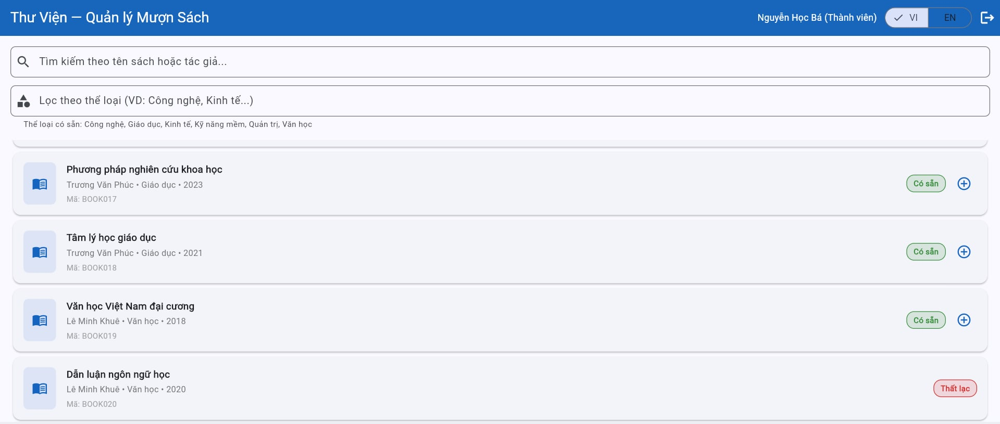 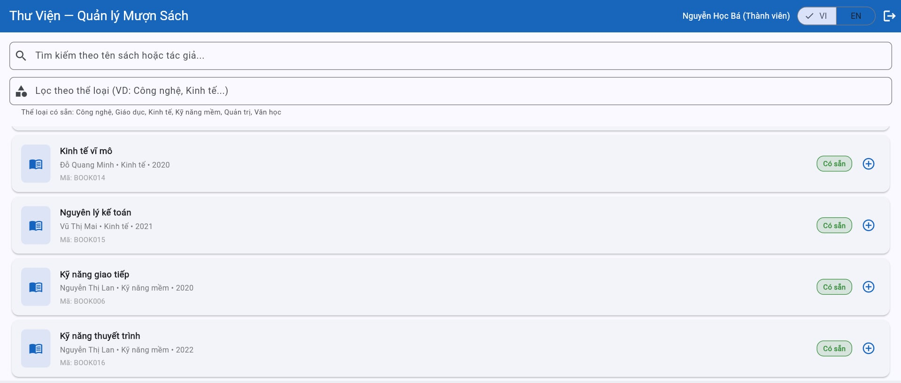  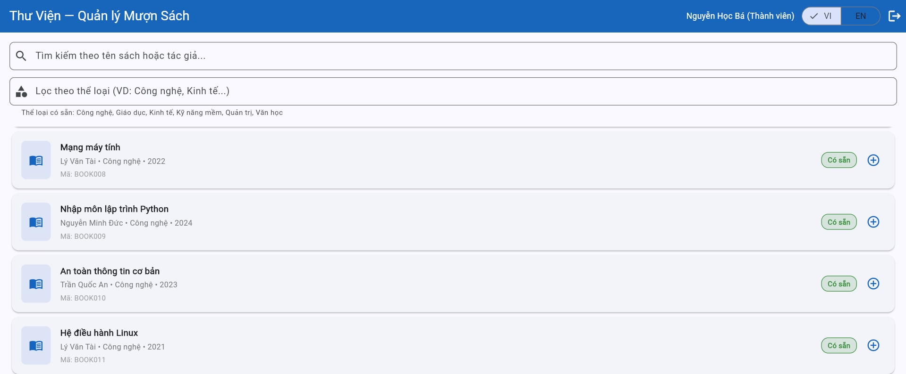 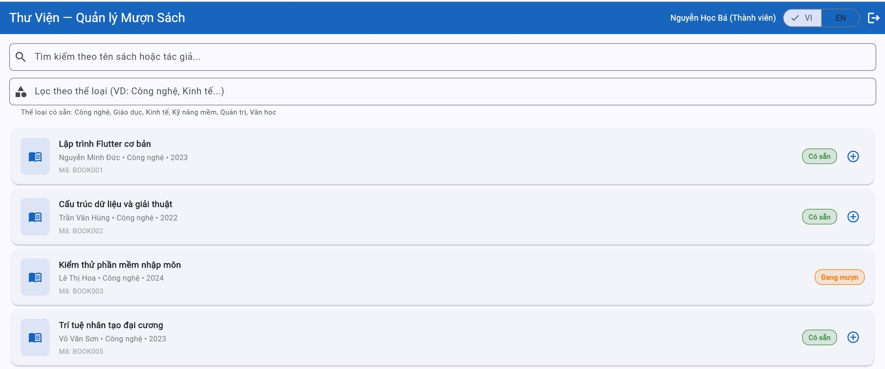| None |
| TC-02 | REQ-02 (View Book) |Book status changes to "Borrowed" and (+) button is hidden instantly without page refresh (F5)|Status updates to "Borrowed", and the (+) button disappears instantly without needing a page refresh|Pass| |None|
| TC-03 | REQ-02 (View Book) |Librarian can view all 20 books with the 5 detailed fields |Librarian can view all 20 books with the exact same 5 details as a Member |Pass|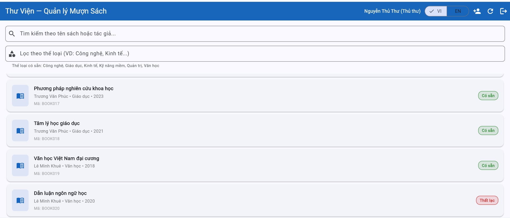 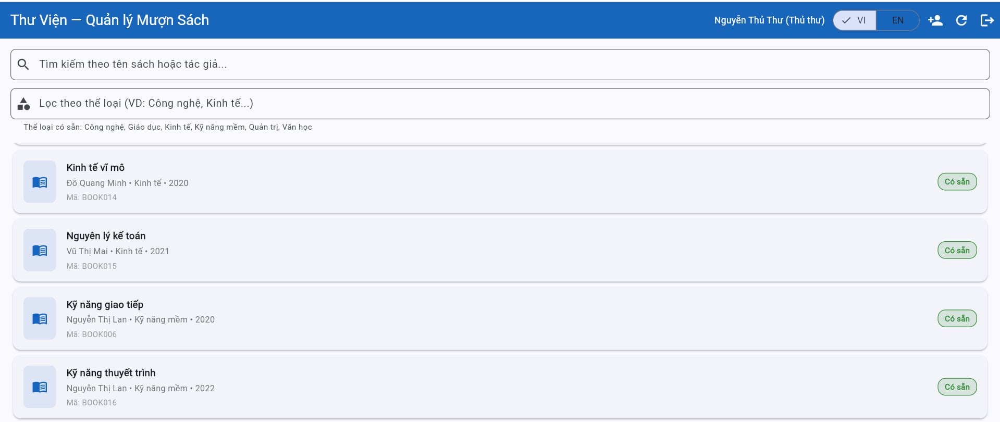 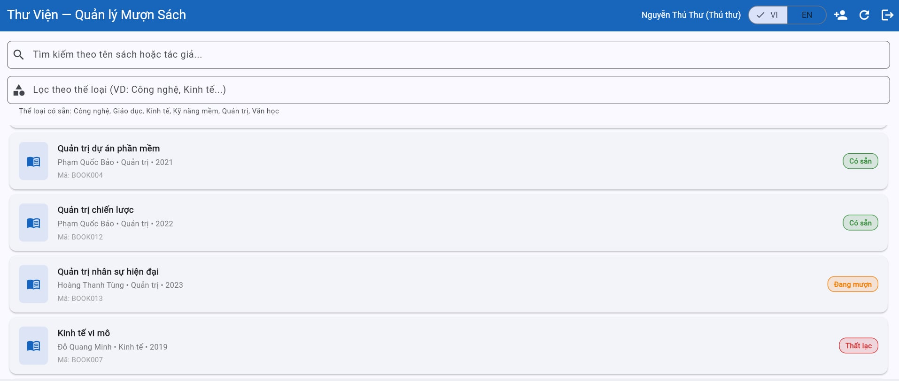 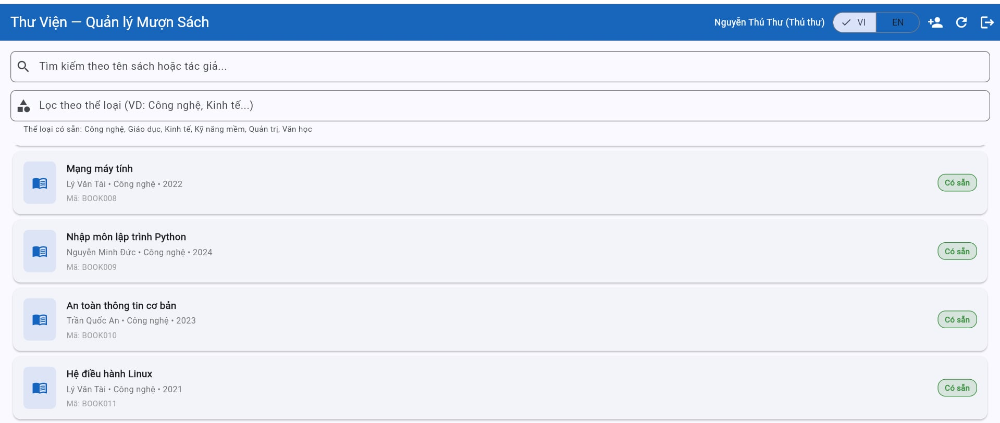 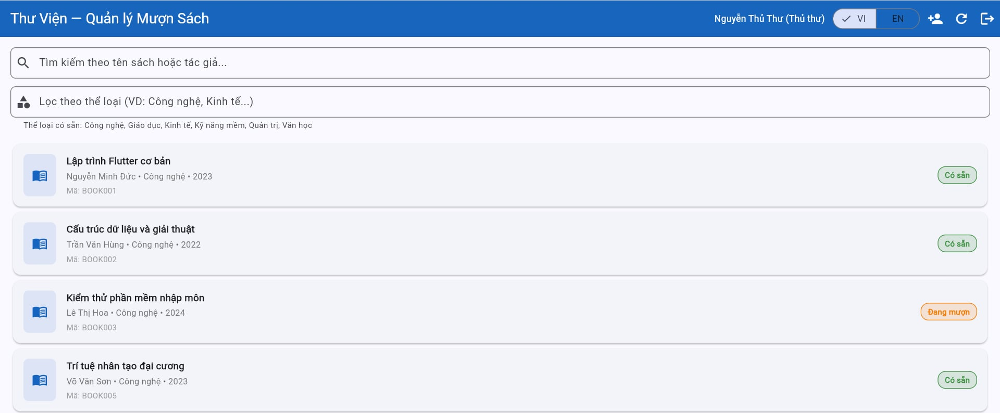|None|
| TC-04 | REQ-04 (Borrow) |Shows success message. Borrow record shows due date = borrow date + 14 days |Success message displayed. Borrow/Return tab shows the due date is exactly 14 days from the borrow date|Pass| |None|
| TC-05 | REQ-04 (Borrow) |System rejects the 4th book attempt with a "limit reached" error message|System allows borrowing up to the 4th book successfully. It only rejects and shows an error on the 5th attempt|Fail||BUG|                 
| TC-06 | REQ-04 (Borrow) |System rejects the action and shows a specific error for "Suspended" accounts|System blocks the action but displays the incorrect error message: "Member has expired"|Fail||BUG|
| TC-07 | REQ-04 (Borrow) |Books with "Borrowed" status have the (+) borrow button hidden/disabled|BOOK003 does not have the (+) button; the borrow action cannot be performed|Pass|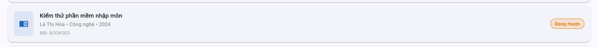|None|
| TC-08 | REQ-04 (Borrow) |System rejects the action and shows an error message for "Expired" accounts|System blocks the action and displays the correct error message for expired accounts|Pass||None|
| TC-09 | REQ-04 (Borrow) |Books with "Lost" status have the (+) borrow button hidden/disabled|BOOK007 does not have the (+) button; the borrow action cannot be performed|Pass||None|
| TC-10 | REQ-04 (Borrow) |System allows successful borrow (bringing the total active borrows to exactly 2)|System allows the borrow action successfully, bringing the total number of borrowed books to 2|Pass|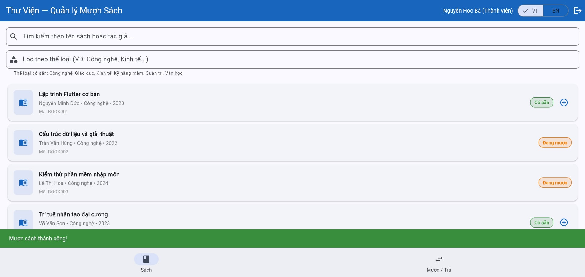 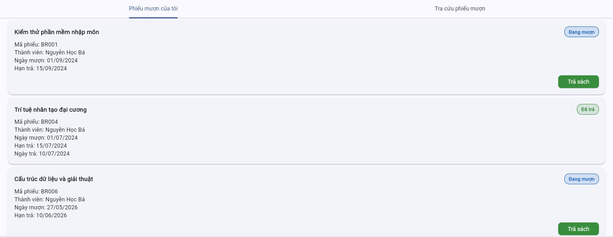|None|

---

## Tổng hợp kết quả

| Chỉ số | Giá trị |
|--------|---------|
| Tổng số test case | `<!-- số -->` |
| Pass | `<!-- số -->` |
| Fail | `<!-- số -->` |
| Blocked | `<!-- số -->` |
| Not Run | `<!-- số -->` |
| **Tỷ lệ Pass** | `<!-- xx% -->` |

### Kết quả theo nhóm chức năng

| Nhóm | Tổng TC | Pass | Fail | Tỷ lệ Pass |
|------|---------|------|------|------------|
| | | | | |
